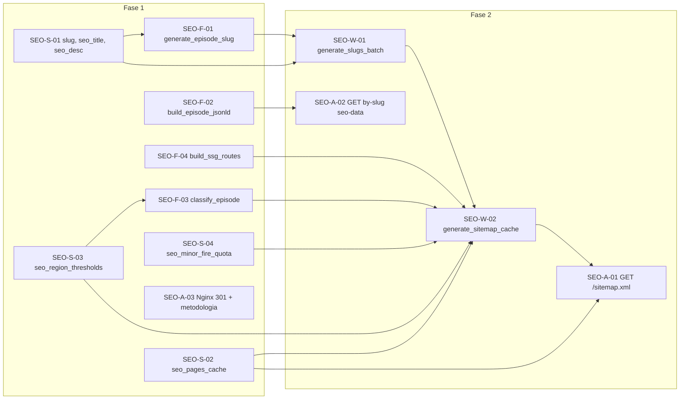

# Plan: Viabilidad SEO/GEO Fases 1-2 y documento de tareas técnicas

## 1. Resumen de viabilidad

**Las fases 1 y 2 son viables** con correcciones concretas. El plan está bien estructurado y alineado con la arquitectura (FastAPI, Celery, Postgres, Redis). Los hallazgos principales son: desajustes con el modelo actual de `fire_episodes`, dependencias inexistentes (`strategic_zones`), uso implícito de columnas que no existen, y detalles de API/Nginx que deben fijarse para no romper rutas ni duplicados.

---

## 1.1 Puntos fuertes validados (revisión humana)

- **Evitar migraciones innecesarias:** Usar la constante en código para `STRATEGIC_ZONES` en lugar de crear la tabla es pragmático y acelera el MVP.
- **Sintaxis SQL correcta:** `INSERT ... ON CONFLICT` y `text()` con parámetros nombrados (`:slug`) son la forma correcta en este stack; no existe `.upsert()` ni placeholders `%s` nativos.
- **SITE_BASE_URL:** Variable de entorno obligatoria. Si Nginx sirve el sitemap con el dominio temporal (p. ej. freedynamicdns.org), Google indexaría ese dominio y se generaría contenido duplicado masivo.

---

## 2. Restricciones y dependencias del código actual

### 2.1 Modelo `FireEpisode` ([app/models/episode.py](app/models/episode.py))

El plan asume columnas que **no existen** hoy:


| Plan / worker asume       | Estado actual                                                                              |
| ------------------------- | ------------------------------------------------------------------------------------------ |
| `province_name` (string)  | No existe; existe `provinces` (ARRAY de strings, ej. `["Córdoba"]`)                        |
| `province_slug`           | No existe                                                                                  |
| `thumbnail_url`           | No existe; la URL está en `slides_data[].thumbnail_url`                                    |
| `has_satellite_images`    | No existe; derivable de `jsonb_array_length(slides_data) > 0` y slides con `thumbnail_url` |
| `duration_days`           | No existe; derivable de `start_date` y `end_date`/`last_seen_at`                           |
| `started_at` / `ended_at` | El modelo usa `start_date` y `end_date`                                                    |
| `affected_area_ha`        | El modelo usa `estimated_area_hectares`                                                    |


**Restricción:** La Fase 1 solo debe añadir en migraciones: `slug`, `seo_title`, `seo_description`. No es obligatorio añadir `province_slug` ni `thumbnail_url` si se derivan en lectura/workers.

### 2.2 Tabla `strategic_zones`

El worker SEO-W-02 hace:

```python
for z in db.execute("SELECT slug FROM strategic_zones WHERE active = true"):
```

Esa tabla **no existe** en [docs/architecture/schema.md](docs/architecture/schema.md) ni en el código. Opciones:

- **Recomendada para Fase 2:** No crear la tabla; en el worker usar la lista constante `STRATEGIC_ZONES` de [SEO-F-04](docs/tasks/seo_geo_technical_tasks_v9.md) (mismo origen que `build_ssg_routes_payload`) para generar las URLs de zonas en el sitemap. Así el sitemap y las rutas SSG quedan alineados sin nueva migración.
- **Opcional posterior:** Migración que cree `strategic_zones` si se quiere administrar zonas por DB/CMS.

### 2.3 API y Nginx

- **Prefijo de episodios:** La API monta episodios en `/api/v1/fire-episodes` ([app/main.py](app/main.py)), no en `/api/v1/episodes`. El nuevo endpoint debe ser coherente: p. ej. `GET /api/v1/fire-episodes/by-slug/{slug}/seo-data` para no chocar con `GET /api/v1/fire-episodes/{episode_id}` (UUID).
- **Sitemap:** Hoy Nginx envía `/` al frontend. Para que el sitemap lo sirva la API hace falta:
  - En Nginx: `location = /sitemap.xml { proxy_pass http://api:8000/sitemap.xml; ... }`.
  - En FastAPI: router de SEO montado con `prefix=""` y ruta `GET /sitemap.xml`.
- **Dominio:** El plan usa `https://forestguard.com.ar`; en [nginx.conf](nginx.conf) aparece `forestguard.freedynamicdns.org`. Debe usarse una **BASE_URL configurable** (p. ej. `SITE_BASE_URL` en settings) para canonical, JSON-LD y redirecciones.

### 2.4 Workers y DB

- **Sesión:** Los workers usan `SessionLocal()` de [app/db/session.py](app/db/session.py) (patrón en [workers/tasks/clustering_task.py](workers/tasks/clustering_task.py)). Las tareas SEO deben usar el mismo patrón: `db = SessionLocal()` en el task, `try/commit/finally/close`.
- **Upsert:** El plan usa `db.upsert("seo_pages_cache", {...})`. SQLAlchemy no tiene `upsert` directo. Implementar con **INSERT ... ON CONFLICT (page_type, slug) DO UPDATE** (raw SQL o `session.execute(text(...))`).
- **SQL parametrizado:** El plan usa placeholders `%s` (estilo psycopg2). En el proyecto se usa SQLAlchemy `text()` con bind params (`:name`). Unificar en `text("... :param ...")` y `{"param": value}`.

---

## 3. Errores lógicos y correcciones

### 3.1 SEO-F-01 `generate_episode_slug`

- **Entrada:** El plan recibe `province: str` y `year: int`. En el modelo no hay `province_name`; el “province” viene de `provinces[0]` (nombre para mostrar, ej. "Córdoba"). Quien llama al slug (p. ej. SEO-W-01) debe pasar **siempre un valor seguro**: `(episode.provinces[0] if episode.provinces else "argentina", episode.start_date.year, str(episode.id), db)`. Nunca usar `provinces[0]` sin comprobar que la lista no esté vacía (riesgo de `IndexError` y caída del worker).
- **Consulta de colisión:** Usar `text("SELECT slug FROM fire_episodes WHERE slug LIKE :prefix")` y `{"prefix": f"{candidate}%"}`. Los resultados son filas; construir `existing = {row["slug"] for row in ...}`.

### 3.2 SEO-W-01 `generate_slugs_batch`

- **Transacción:** Reemplazar `with db.begin():` por el patrón estándar: `db = SessionLocal(); try: ...; db.commit(); finally: db.close()`.
- **UPDATE:** Usar `text("UPDATE fire_episodes SET slug = :slug WHERE id = :id AND slug IS NULL")` y parámetros nombrados. No usar `%s`.
- **Origen del año:** Usar `ep["start_date"].year` (el modelo tiene `start_date`, no `started_at`).
- **Bloqueo concurrente (imperativo):** Al refactorizar la consulta a `text()`, la sentencia **SELECT** debe incluir explícitamente `**FOR UPDATE SKIP LOCKED`** en la cadena SQL (p. ej. `SELECT id, provinces, start_date FROM fire_episodes WHERE slug IS NULL ORDER BY id LIMIT 500 FOR UPDATE SKIP LOCKED`). Si se omite al pasar a SQL crudo, dos instancias de Celery podrán procesar los mismos registros y reaparecerán condiciones de carrera. Incluir esta cláusula en el documento de tareas y en los tests/code review.

### 3.3 SEO-W-02 `generate_sitemap_cache`

- **Query de episodios:** No seleccionar columnas inexistentes. Seleccionar: `slug`, `updated_at`, `estimated_area_hectares`, `status`, `slides_data`, `provinces`, `start_date`, `end_date`, `last_seen_at`. En Python por cada fila:
  - `has_satellite_images`: `bool(slides_data and len(slides_data) > 0 and any(s.get("thumbnail_url") for s in slides_data))`.
  - `duration_days`: si `end_date` o `last_seen_at`, `(end_date or last_seen_at - start_date).days`, sino `None`.
  - `**province_slug` (acceso seguro):** `provinces[0]` puede no existir si el arreglo está vacío (ingesta errónea). Usar: `province_name = (row["provinces"] or [None])[0]` y luego normalizar; o bien `(row["provinces"][0] if row.get("provinces") else "argentina")` antes de normalizar a slug. Así se evita `IndexError` y la caída del worker.
  - `**thumbnail_url` (extracción segura y XML sin nulos):** Usar `thumbnail_url = next((s.get("thumbnail_url") for s in (row.get("slides_data") or []) if s.get("thumbnail_url")), None)`. **Solo si `thumbnail_url` tiene valor** se inyecta el bloque `<image:image><image:loc>...</image:loc></image:image>` en el XML; si es `None` o cadena vacía, no emitir el bloque para no romper el XML ni incluir URLs vacías.
- **Umbral:** Pasar `affected_area_ha = (row["estimated_area_hectares"] or 0)` a `classify_episode_for_sitemap`.
- **Zonas:** No consultar `strategic_zones`. Iterar sobre la lista constante `STRATEGIC_ZONES` (definida en el mismo módulo o importada de `ssg_routes`) y añadir `_url_entry(f"/zonas/{z}", "weekly", "0.8")`.
- **Upsert caché:** Reemplazar `db.upsert(...)` por un `INSERT INTO seo_pages_cache (...) VALUES (...) ON CONFLICT (page_type, slug) DO UPDATE SET content = EXCLUDED.content, cached_at = ..., expires_at = ..., stale_until = ...`.

### 3.4 SEO-F-02 `build_episode_jsonld`

- **Temporal:** Aceptar en el dict `start_date`/`end_date` (datetime) o `started_at`/`ended_at` (ISO string). Internamente normalizar a ISO para `temporalCoverage` (p. ej. con `start_date.isoformat()` si es datetime).
- **Bbox:** El modelo usa `bbox_minx`, `bbox_miny`, `bbox_maxx`, `bbox_maxy`. El plan ya los usa; asegurar que el dict que llega desde la API/worker tenga esas claves (desde el ORM son atributos del mismo nombre).

### 3.5 SEO-A-02 endpoint seo-data

- **Lookup:** Obtener episodio por `slug`: `db.query(FireEpisode).filter(FireEpisode.slug == slug).first()`.
- **Dict para JSON-LD:** Si se pasa el ORM, convertir a dict con las claves que espera `build_episode_jsonld` (incl. `start_date`/`end_date` o sus equivalentes ISO). Para `province_name` (keywords): usar **acceso seguro** `episode.provinces[0] if episode.provinces else "Argentina"` para evitar `IndexError`.

### 3.6 Nginx

- **Trailing slash:** Añadir la regla 301 **antes** del `location /` del SPA para que no la capture el frontend: `location ~ ^(.+[^/])/$ { return 301 $scheme://$host$1$is_args$args; }`.
- **Metodología:** Si se usa `location = /metodologia` con `try_files /metodologia.html`, el archivo debe existir en el root del frontend (p. ej. generado por build o estático). Si hoy no existe, documentar como tarea: “Asegurar que el build o el servidor estático exponga `/metodologia.html`” o servir la ruta desde el SPA y no desde Nginx estático.
- **Cabeceras de proxy para `/sitemap.xml`:** En `location = /sitemap.xml` es **crítico** reenviar las cabeceras del cliente para que FastAPI registre la IP real y no la del contenedor Nginx. Incluir: `proxy_set_header X-Real-IP $remote_addr;`, `proxy_set_header X-Forwarded-For $proxy_add_x_forwarded_for;`, `proxy_set_header X-Forwarded-Proto $scheme;`, `proxy_set_header Host $host;` (alineado al resto de locations que proxy_pass al API).

### 3.7 Celery beat

- **Inclusión del módulo:** Añadir `workers.tasks.seo` en `include` de [workers/celery_app.py](workers/celery_app.py).
- **Rutas:** Asignar las tareas SEO a la cola `default` (o la que corresponda) en `task_routes`.
- **Entradas beat:** `generate_slugs_batch` (diario) y `generate_sitemap_cache` (cada 5 h con `crontab(minute=0, hour="*/5")`). El beat ya usa `America/Argentina/Buenos_Aires`; mantenerlo para consistencia.

---

## 4. Mejoras (robustez, escalabilidad, tráfico orgánico)

### 4.1 Robustez

- **Redis en API:** El plan usa `get_redis` en SEO-A-01; en el proyecto no hay dependencia FastAPI para Redis. Crear `get_redis()` en [app/api/deps.py](app/api/deps.py) (o donde estén deps) que devuelva `redis_service.redis_client`, y usarla en el endpoint del sitemap.
- **Sitemap sin caché inicial — mitigación automática (sin pasos manuales):** En lugar de depender de la ejecución manual del worker tras el primer deploy, usar el **evento de ciclo de vida de FastAPI** (lifespan o `@app.on_event("startup")`). Al arrancar la API: consultar si existe una fila en `seo_pages_cache` con `page_type = 'sitemap'` y `slug = 'main'`. Si **no** existe (tabla vacía o sin sitemap), encolar una sola vez `generate_sitemap_cache.delay()`. Así la primera petición a `/sitemap.xml` puede seguir devolviendo 503 hasta que el worker termine, pero no se requiere intervención humana; en despliegues posteriores la caché ya existirá. Documentar este comportamiento en el documento de tareas.
- **Bloqueo Redis:** Mantener `SETNX` + TTL para evitar múltiples regeneraciones; el plan ya lo tiene.

### 4.1.1 Refinamientos críticos (obligatorios en implementación)

Resumen de los cuatro ajustes que deben aplicarse en el documento de tareas y en código:


| Refinamiento                           | Riesgo si no se aplica                                                                | Solución                                                                                                                                                                            |
| -------------------------------------- | ------------------------------------------------------------------------------------- | ----------------------------------------------------------------------------------------------------------------------------------------------------------------------------------- |
| **Acceso seguro a provincia**          | `IndexError` si `provinces` está vacío → caída del worker/sitemap                     | Usar `provinces[0] if provinces else "argentina"` (o "Argentina" donde se necesite nombre para mostrar) en SEO-W-01, SEO-W-02, SEO-A-02 y en el caller de SEO-F-01.                 |
| **503 inicial**                        | Infraestructura depende de pasos manuales tras el deploy                              | En `app/main.py`, lifespan o startup: si no existe fila (sitemap, main) en `seo_pages_cache`, encolar `generate_sitemap_cache.delay()` una sola vez.                                |
| **Extracción segura de thumbnail**     | Valores nulos o vacíos en JSONB rompen el XML o generan `<image:loc></image:loc>`     | `thumbnail_url = next((s.get("thumbnail_url") for s in (slides_data or []) if s.get("thumbnail_url")), None)`; emitir bloque `<image:image>` **solo si** `thumbnail_url` es truthy. |
| **Cabeceras de proxy en Nginx**        | Logs de FastAPI muestran IP del contenedor Nginx, no la del cliente                   | En `location = /sitemap.xml`: incluir `proxy_set_header X-Real-IP $remote_addr;`, `X-Forwarded-For`, `X-Forwarded-Proto`, `Host`.                                                   |
| **FOR UPDATE SKIP LOCKED en SEO-W-01** | Dos workers Celery en paralelo procesan los mismos episodios → condiciones de carrera | En la sentencia SELECT del worker de slugs, mantener **explícito** `FOR UPDATE SKIP LOCKED` al usar `text()`; no omitir al migrar de SQL legacy a parámetros nombrados.             |


**Impacto en bots:** Con estos ajustes, el plan es amigable para motores de búsqueda; stale-while-revalidate evita “puerta cerrada” a Googlebot y la canonical con SITE_BASE_URL unifica la autoridad del dominio sin riesgo de penalizaciones.

---

### 4.2 Escalabilidad

- **Límite 500 en SEO-W-01:** El `LIMIT 500` por ejecución está bien; en varios días se irán cubriendo episodios sin slug. Dejar claro en la tarea que es “por batch”, no global.
- **Sitemap único:** Con miles de URLs, considerar más adelante sitemap index + sitemaps parciales (p. ej. por provincia o rangos). Para Fase 2, un solo sitemap es aceptable (límite recomendado Google 50.000 URLs).

### 4.3 Tráfico orgánico

- **Image sitemap:** Mantener el namespace `image:` y `<image:loc>` por episodio con thumbnail; ya está en el plan y es una mejora clara para Google Images.
- **Canonical y 301:** Trailing slash 301 + canonical en páginas evita duplicados; el plan es correcto.
- **JSON-LD Dataset con @id:** Ya contemplado (VUL-17); asegurar que el endpoint seo-data y el JSON-LD usen la misma URL canónica (SITE_BASE_URL).

---

## 5. Contenido del nuevo documento de tareas técnicas

El **nuevo documento** (p. ej. `docs/tasks/seo_geo_fase1_fase2_tareas.md`) debe:

1. **Encabezado y alcance**
  - Versión y fecha.  
  - Alcance: solo Fase 1 y Fase 2; Fase 3 queda fuera.  
  - Referencia al análisis (este plan) y al doc original v9.
2. **Prerrequisitos**
  - Migraciones aplicadas (SEO-S-01 a SEO-S-04).  
  - Configuración: `SITE_BASE_URL` (y opcionalmente `REDIS_URL`).  
  - **Sin paso manual:** Arranque automático del sitemap vía lifespan/startup de FastAPI (ver sección 4.1).
3. **Fase 1 — Tareas corregidas**
  - **SEO-S-01 a SEO-S-04:** Sin cambios en el SQL; dejar explícito que en `fire_episodes` solo se añaden `slug`, `seo_title`, `seo_description`.  
  - **SEO-F-01:** Especificar que el caller debe pasar **siempre valor seguro**: `(provinces[0] if provinces else "argentina", start_date.year, str(id), db)`; implementación con `text()` y `:prefix`; tests con Session real o mock (incl. caso `provinces=[]`).  
  - **SEO-F-02:** Aceptar `start_date`/`end_date` o `started_at`/`ended_at`; usar siempre ISO en `temporalCoverage`; clave de área `estimated_area_hectares` si se usa.  
  - **SEO-F-03:** Sin cambios de lógica; documentar que el `episode` dict debe llevar `affected_area_ha` (desde `estimated_area_hectares`), `province_slug`, `has_satellite_images`, `duration_days` calculados por el caller.  
  - **SEO-F-04:** Mantener listas; para zonas, documentar que el worker de sitemap usará la misma constante `STRATEGIC_ZONES` (no DB).  
  - **SEO-A-03 (Nginx):** Incluir fragmento exacto para trailing slash y para `/metodologia`; indicar que debe integrarse en el `server` HTTPS existente de [nginx.conf](nginx.conf) (o el que use producción).  
  - **Verificación Fase 1:** Comandos de comprobación (migración, 301, existencia de columnas).
4. **Fase 2 — Tareas corregidas**
  - **SEO-W-01:** Código de referencia con `SessionLocal()`, `text()` con parámetros nombrados, uso de `provinces[0] if provinces else "argentina"` y `start_date.year`; **SELECT con `FOR UPDATE SKIP LOCKED` explícito** para evitar condiciones de carrera con workers en paralelo; registro en beat (diario).  
  - **SEO-W-02:** Query de episodios solo con columnas existentes; derivación en Python con **acceso seguro**: `province_slug` desde `(provinces[0] if provinces else "argentina")`; `thumbnail_url = next((s.get("thumbnail_url") for s in (slides_data or []) if s.get("thumbnail_url")), None)` y **solo si es truthy** inyectar `<image:image>` en el XML; zonas desde constante; upsert con `ON CONFLICT`; schedule cada 5 h; tests que no dependan de `strategic_zones`.
  - **SEO-A-01:** Router montado con `prefix=""`; ruta `GET /sitemap.xml`; dependencia `get_redis`; lógica de caché/503/stale/headers según plan; **startup/lifespan:** si no existe fila sitemap en `seo_pages_cache`, encolar `generate_sitemap_cache.delay()` al arranque; Nginx `location = /sitemap.xml` con **cabeceras de proxy** (X-Real-IP, X-Forwarded-For, X-Forwarded-Proto, Host).
  - **SEO-A-02:** Ruta `GET /api/v1/fire-episodes/by-slug/{slug}/seo-data`; lookup por `FireEpisode.slug`; respuesta con `build_episode_jsonld` recibiendo un dict construido desde el ORM (con `start_date`/`end_date` y opcionalmente `province_name` desde `provinces[0]`).  
  - **SEO-A-0X (preparación Fase 3):** Endpoint ligero `GET /api/v1/fire-episodes/stats/counts` que devuelva el **volumen total de episodios agrupados por provincia y por zona** (p. ej. `{ "by_province": { "cordoba": 45, ... }, "by_zone": { "delta-del-parana": 12, ... } }` o equivalente). El script de exportación SSG (Fase 3) y el CI (entorno desconectado) podrán consumir este endpoint para construir la paginación de rutas estáticas sin cálculos pesados en memoria. Incluir en Fase 2 para no bloquear Fase 3.
  - **Celery:** Inclusión de `workers.tasks.seo`, rutas de cola y entradas de beat.  
  - **Verificación Fase 2:** curl a `/sitemap.xml`, comprobación de `image:loc`, `by-slug/{slug}/seo-data` y `fire-episodes/stats/counts`; revisión de que el SELECT de SEO-W-01 incluye `FOR UPDATE SKIP LOCKED`.
5. **Tabla de esfuerzos**
  - Revisar estimaciones a la luz de los cambios (derivaciones en Python, upsert, dependencia Redis, Nginx).
6. **Riesgos y deuda**
  - Sin tabla `strategic_zones`: zonas fijas en código; cambio futuro si se desea CMS.  
  - Sitemap inicial: 503 posible solo en la primera ventana hasta que el worker (encolado en startup) termine; mitigación automática vía lifespan/startup, sin pasos manuales.

---

## 6. Diagrama de dependencias (Fase 1 y 2)




---

## 7. Orden de implementación sugerido

1. Migraciones (SEO-S-01 a SEO-S-04) y configuración `SITE_BASE_URL`.
2. Utilidades: SEO-F-01, SEO-F-02, SEO-F-03, SEO-F-04 (y constante `STRATEGIC_ZONES` compartida).
3. Nginx: SEO-A-03 (trailing slash + metodología).
4. Worker SEO-W-01 + beat.
5. Worker SEO-W-02 (con query y derivaciones corregidas) + beat.
6. API: `get_redis`, SEO-A-01, SEO-A-02; montaje del router SEO; Nginx `location = /sitemap.xml`.
7. **Startup de la API:** Implementar en lifespan/startup la comprobación de `seo_pages_cache` vacía y encolado de `generate_sitemap_cache.delay()` (sin paso manual de “ejecutar worker tras deploy”).

El **documento de tareas** debe escribirse siguiendo esta estructura y las correcciones anteriores, de forma que un desarrollador pueda implementar Fase 1 y Fase 2 sin depender de columnas o tablas inexistentes, con API/Nginx/workers alineados al código actual, y con los **refinamientos críticos** aplicados: acceso seguro a `provinces[0]`, extracción segura de `thumbnail_url` y emisión condicional de `<image:image>`, cabeceras de proxy en Nginx para `/sitemap.xml`, y mitigación automática del 503 inicial vía lifespan/startup. Con estos ajustes, el plan es amigable para motores de búsqueda (stale-while-revalidate + canonical con SITE_BASE_URL) sin riesgo de penalizaciones.