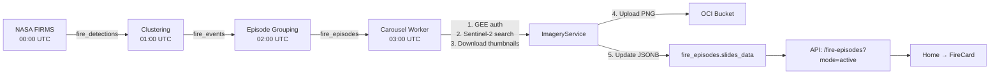

> **Nota de vigencia (2026-03)**  
> Este documento describe el flujo de ingesta y carrusel en detalle y sigue siendo útil como **referencia conceptual**.  
> Sin embargo, la fuente canónica actual para el flujo de ingesta y pipeline E2E son:
> - `docs/core-flows/core-ingesta/core-ingesta-overview.md`
> - `docs/core-flows/core-ingesta/core-ingesta-design.md`
> - `docs/core-flows/core-pipeline-e2e/core-pipeline-overview.md`  
> Para topología de workers y contenedores, ver también `docs/containers/workers.md`.

# Carousel Thumbnail Flow: Analysis & Fix Plan

## Flow Summary



### Carousel Worker Detail (03:00 UTC / 00:00 ART)

| Step | What happens | Key code |
|------|-------------|----------|
| 1 | `GEEService.authenticate()` — authenticates via `GEE_SERVICE_ACCOUNT_EMAIL` + `GEE_PRIVATE_KEY_PATH` | [gee_service.py:281-377](file:///c:/Users/nicog/wildfire-recovery-argentina/app/services/gee_service.py#L281-L377) |
| 2 | Fetch top-N episodes (`gee_candidate=true`, sort by `gee_priority`) | [imagery_service.py:367-399](file:///c:/Users/nicog/wildfire-recovery-argentina/app/services/imagery_service.py#L367-L399) |
| 3 | For each episode: [_select_image()](file:///c:/Users/nicog/wildfire-recovery-argentina/app/services/imagery_service.py#494-528) — Sentinel-2, progressive cloud thresholds 10→20→30→50%, 7-day window, 30-day archive fallback | [imagery_service.py:494-527](file:///c:/Users/nicog/wildfire-recovery-argentina/app/services/imagery_service.py#L494-L527) |
| 4 | Download 3 thumbnails (SWIR/RGB/NBR) at 768×576, apply watermark | [imagery_service.py:690-714](file:///c:/Users/nicog/wildfire-recovery-argentina/app/services/imagery_service.py#L690-L714) |
| 5 | Upload to OCI: `carousel/{episode_id}/{vis_type}_{date}.png` via `StorageService.upload_bytes()` | [imagery_service.py:549-567](file:///c:/Users/nicog/wildfire-recovery-argentina/app/services/imagery_service.py#L549-L567) |
| 6 | Update `fire_episodes.slides_data` JSONB + save `SatelliteImage` record | [imagery_service.py:767-770](file:///c:/Users/nicog/wildfire-recovery-argentina/app/services/imagery_service.py#L767-L770) |

### Two independent credential chains

| Purpose | Env vars needed | Backend |
|---------|----------------|---------|
| **GEE** (satellite images) | `GEE_SERVICE_ACCOUNT_EMAIL` + `GEE_PRIVATE_KEY_PATH` (or `GEE_SERVICE_ACCOUNT_JSON`) + `GEE_PROJECT_ID` | Google Earth Engine API |
| **Storage** (upload/serve) | `OCI_S3_ACCESS_KEY` + `OCI_S3_SECRET_KEY` + `OCI_S3_ENDPOINT_URL` + `STORAGE_BACKEND=oci` | OCI Object Storage (S3-compatible) |

---

## Root Cause

> Nota 2026-03: este documento refleja el estado previo a la consolidación de workers en `worker-fast` y `worker-gee`.  
> En el diseño actual, la cola `analysis`/`vae` es atendida por `worker-gee`, que ya tiene las variables GEE configuradas.  
> Para la topología vigente ver `docs/containers/workers.md`. El análisis siguiente se mantiene como histórico.

### `worker-analysis` is missing GEE env vars

The [docker-compose.yml](file:///c:/Users/nicog/wildfire-recovery-argentina/docker-compose.yml) `worker-analysis` service (line 211) has **OCI storage vars** (correct ✓), but has **zero GEE vars** (❌). Only `worker-reports` (line 266) has `GEE_PROJECT_ID` and `GEE_SERVICE_ACCOUNT_EMAIL`.

The carousel task runs on `worker-analysis` (queue `analysis`), so when `GEEService.authenticate()` is called, it falls through all options to Option 4 (`ee.Initialize()` with default credentials), which fails in a Docker container with no gcloud auth configured.

> [!CAUTION]
> Additionally, `GOOGLE_APPLICATION_CREDENTIALS` and `GCS_*` vars are still present in all workers but these are **legacy GCS** references that are no longer needed. They should be commented out to avoid confusion.

---

## Proposed Changes

### [MODIFY] [docker-compose.yml](file:///c:/Users/nicog/wildfire-recovery-argentina/docker-compose.yml)

**1. Add GEE env vars to `worker-analysis`** (required for carousel):

```diff
       ENVIRONMENT: ${ENVIRONMENT:-production}
+
+      # Google Earth Engine (independent from storage)
+      GEE_PROJECT_ID: ${GEE_PROJECT_ID:-}
+      GEE_SERVICE_ACCOUNT_EMAIL: ${GEE_SERVICE_ACCOUNT_EMAIL:-}
+      GEE_PRIVATE_KEY_PATH: ${GEE_PRIVATE_KEY_PATH:-/run/secrets/gcp-sa.json}
```

**2. Mark GCS vars as legacy and comment them out** in ALL workers (`worker-ingestion`, `worker-clustering`, `worker-analysis`, `worker-reports`, `api`):

```diff
-      GOOGLE_APPLICATION_CREDENTIALS: ${GOOGLE_APPLICATION_CREDENTIALS:-/run/secrets/gcp-sa.json}
-      GCS_SERVICE_ACCOUNT_JSON: ${GCS_SERVICE_ACCOUNT_JSON:-/run/secrets/gcp-sa.json}
-      GCS_PROJECT_ID: ${GCS_PROJECT_ID:-}
+      # LEGACY (GCS) — not needed, OCI is the active storage backend
+      # GOOGLE_APPLICATION_CREDENTIALS: ${GOOGLE_APPLICATION_CREDENTIALS:-/run/secrets/gcp-sa.json}
+      # GCS_SERVICE_ACCOUNT_JSON: ${GCS_SERVICE_ACCOUNT_JSON:-/run/secrets/gcp-sa.json}
+      # GCS_PROJECT_ID: ${GCS_PROJECT_ID:-}
```

---

## Manual Thumbnail Generation (on production VM)

### Step 1: Diagnostics
```bash
# Check beat is scheduling carousel
docker logs forestguard-celery-beat 2>&1 | grep -i carousel | tail -5

# Check worker-analysis logs for GEE errors
docker logs forestguard-worker-analysis 2>&1 | grep -iE "carousel|gee|authenticate" | tail -20

# Check DB state
docker exec forestguard-api python -c "
from app.db.session import SessionLocal
from sqlalchemy import text
db = SessionLocal()
r = db.execute(text(\"SELECT count(*) FROM fire_episodes WHERE gee_candidate AND status IN ('active','monitoring')\")).scalar()
s = db.execute(text(\"SELECT count(*) FROM fire_episodes WHERE slides_data IS NOT NULL AND jsonb_array_length(slides_data) > 0\")).scalar()
print(f'GEE candidates: {r}, With slides: {s}')
db.close()
"
```

### Step 2: After adding GEE vars → manual trigger
```bash
docker exec -it forestguard-worker-analysis \
  celery -A workers.celery_app call \
  workers.tasks.carousel_task.generate_carousel \
  --kwargs='{"force_refresh": true}'
```

### Step 3: Monitor
```bash
docker logs --tail 200 -f forestguard-worker-analysis
```

### Step 4: Verify
```sql
SELECT id, status, gee_priority, jsonb_array_length(slides_data) as slides
FROM fire_episodes WHERE status IN ('active', 'monitoring')
ORDER BY gee_priority DESC NULLS LAST LIMIT 20;
```

---

## Celery Beat Schedule

| Task | UTC | ART (UTC-3) | Worker |
|------|-----|-------------|--------|
| `download-firms-daily` | 00:00 | 21:00 D-1 | ingestion |
| `cluster-daily` | 01:00 | 22:00 D-1 | clustering |
| `cluster-episodes-daily` | 02:00 | 23:00 D-1 | clustering |
| **`carousel-daily`** | **03:00** | **00:00** | **analysis** |
| `cleanup-expired-assets` | 04:00 | 01:00 | default |
| `closure-reports-daily` | 08:00 | 05:00 | analysis |

---

## Questions for User

1. **¿El GEE service account key (JSON) se monta como `/run/secrets/gcp-sa.json`?** ¿O tiene otra ubicación en la VM?
2. **¿Podés conectarte a la VM ahora para correr los comandos diagnósticos del Step 1?**  
3. **¿Existe un `GEE_PRIVATE_KEY_PATH` separado del archivo de credenciales GCS?** (ya que GCS es legacy, necesitamos confirmar qué archivo usa GEE)
