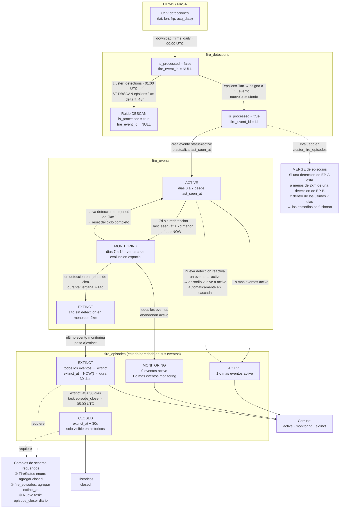

# Flujo detallado de ingesta y procesamiento de datos de detección de incendios

**Proyecto:** ForestGuard  
**Fecha:** 2026-02-24  
**Fuentes:** schema_v5.sql (fuente de verdad), documentación de workers, UC-F08R, pipeline docs.

---

## Diagrama general del pipeline

```
  NASA FIRMS (CSV)          ST-DBSCAN              Agregación             Carrusel GEE
  ──────────────           ──────────              ──────────             ────────────
       │                        │                       │                      │
  00:00 UTC                01:00 UTC               02:00 UTC              03:00 UTC
       │                        │                       │                      │
       ▼                        ▼                       ▼                      ▼
┌──────────────┐      ┌──────────────┐       ┌──────────────────┐    ┌──────────────────┐
│   Ingestion  │      │  Clustering  │       │    Episode        │    │   Carousel       │
│   Worker     │─────▶│  Worker      │──────▶│    Aggregation    │───▶│   Worker         │
│              │      │              │       │    Worker         │    │                  │
└──────┬───────┘      └──────┬───────┘       └────────┬─────────┘    └────────┬─────────┘
       │                     │                        │                       │
       ▼                     ▼                        ▼                       ▼
  fire_detections       fire_events            fire_episodes           satellite_images
                                               fire_episode_events    fire_episodes.slides_data
                                               episode_mergers        OCI Object Storage
```

---

## 1. Ingesta de datos crudos (NASA FIRMS)

### 1.1 Fuente y formato

Los datos provienen de **NASA FIRMS** (Fire Information for Resource Management System), que provee detecciones de puntos de calor (hotspots) satelitales en formato CSV. Las fuentes satelitales son:

- **VIIRS** (Visible Infrared Imaging Radiometer Suite): resolución espacial de 375 m.
- **MODIS** (Moderate Resolution Imaging Spectroradiometer): resolución espacial de 1 km.

Cada fila del CSV representa un único píxel de calor detectado por un instrumento satelital en un momento y ubicación específicos. Los campos del CSV incluyen: latitud, longitud, brillo (temperatura de brillo en Kelvin), potencia radiativa del fuego (FRP), confianza, satélite, instrumento, fecha y hora de adquisición, y un indicador de día/noche.

### 1.2 Mecanismo de obtención y almacenamiento inicial

| Aspecto | Detalle |
|---------|---------|
| Worker responsable | `ingestion.download_firms_daily` |
| Archivo del worker | `workers/tasks/ingestion.py` |
| Cola Celery | `ingestion` |
| Schedule | Diario a las **00:00 UTC** (21:00 ART día anterior) |
| Mecanismo | Descarga HTTP del CSV desde la API REST de NASA FIRMS |
| Procesamiento | Parsing CSV → validación → cálculo de `detected_at` (timestamptz, fuente de verdad temporal) → cálculo de `h3_index` (resolución 8) → insert en PostgreSQL |
| Deduplicación | Por llave compuesta (`satellite`, `instrument`, `detected_at`, `latitude`, `longitude`, `fire_radiative_power`, `confidence_normalized`). Estrategia implementada: hash SHA-256 persistido como `detection_hash`. Pre-filtrado en Python: se consultan hashes existentes para las fechas del batch (`get_existing_hashes`) y se descartan duplicados antes de insertar. |
| Estado inicial de cada registro | `is_processed = false`, `fire_event_id = NULL` |

### 1.3 Tabla poblada: `fire_detections`

| Campo | Tipo | Nullable | Descripción |
|-------|------|----------|-------------|
| `id` | uuid (PK) | NOT NULL | Generado automáticamente (`gen_random_uuid()`) |
| `satellite` | varchar | NOT NULL | Nombre del satélite (ej: "NOAA-20", "Aqua") |
| `instrument` | varchar | NOT NULL | Instrumento (ej: "VIIRS", "MODIS") |
| `detected_at` | timestamptz | NOT NULL | **Fuente de verdad temporal.** Timestamp UTC de la detección |
| `location` | geometry (PostGIS) | NOT NULL | Punto geográfico (SRID 4326) |
| `latitude` | numeric | NOT NULL | Latitud de la detección |
| `longitude` | numeric | NOT NULL | Longitud de la detección |
| `bt_mir_kelvin` | numeric | nullable | Temperatura de brillo en infrarrojo medio (Kelvin) |
| `bt_tir_kelvin` | numeric | nullable | Temperatura de brillo en infrarrojo térmico (Kelvin) |
| `fire_radiative_power` | numeric | nullable | Potencia radiativa del fuego (MW) — indicador de intensidad |
| `confidence_raw` | varchar | nullable | Confianza original del proveedor (texto: "nominal", "high", "low") |
| `confidence_normalized` | integer | nullable | Confianza normalizada (0-100) |
| `acquisition_date` | date | nullable | Fecha raw del CSV (no es fuente de verdad; usar `detected_at`) |
| `acquisition_time` | time | nullable | Hora raw del CSV (no es fuente de verdad; usar `detected_at`) |
| `daynight` | varchar | nullable | Indicador: "D" (día) o "N" (noche) |
| `is_processed` | boolean | default false | Indica si ya fue asignada a un fire_event por el clustering |
| `fire_event_id` | uuid (FK) | nullable | Referencia al evento al que pertenece (NULL hasta clustering) |
| `h3_index` | bigint | nullable | Índice H3 hexagonal (resolución 8) para queries espaciales eficientes |

**FK:** `fire_event_id → fire_events(id)`

**Regla de inmutabilidad:** `fire_detections` es inmutable una vez insertada, excepto por tres campos de procesamiento: `fire_event_id`, `is_processed` y `h3_index`.

---

## 2. Proceso de clustering (agrupamiento espacial y temporal)

### 2.1 Descripción del proceso

El clustering agrupa detecciones individuales (`fire_detections`) en eventos de fuego (`fire_events`) mediante el algoritmo **ST-DBSCAN** (Spatial-Temporal Density-Based Spatial Clustering of Applications with Noise). Este algoritmo extiende DBSCAN clásico incorporando una dimensión temporal además de la espacial.

El worker selecciona detecciones pendientes (`fire_event_id IS NULL`) dentro de una ventana temporal configurable y ejecuta el algoritmo. Cada cluster resultante genera un `fire_event` con su centroide, perímetro estimado y métricas agregadas.

### 2.2 Parámetros de clustering

Los parámetros están versionados en la tabla `clustering_versions`. El worker lee la versión activa (`is_active = true`) al ejecutarse:

| Parámetro | Descripción | Valor típico |
|-----------|-------------|--------------|
| `epsilon_km` | Radio de búsqueda espacial en kilómetros | 1.0 - 2.0 km (calibrado según resolución VIIRS 375 m + margen de movimiento del frente de fuego) |
| `min_points` | Cantidad mínima de detecciones para formar un cluster | 2 - 5 |
| `temporal_window_hours` | Ventana temporal dentro de la cual las detecciones se consideran relacionadas | 24 - 48 horas |
| `algorithm` | Algoritmo utilizado | `ST-DBSCAN` (CHECK constraint permite: DBSCAN, ST-DBSCAN, HDBSCAN) |

**Tabla de versionado: `clustering_versions`**

| Campo | Tipo | Descripción |
|-------|------|-------------|
| `id` | uuid (PK) | Identificador de la versión |
| `version_name` | varchar | Nombre descriptivo (ej: "v2.1-viirs-optimized") |
| `epsilon_km` | numeric | Radio espacial |
| `min_points` | integer | Densidad mínima |
| `temporal_window_hours` | integer | Ventana temporal |
| `algorithm` | varchar | Algoritmo (CHECK: DBSCAN, ST-DBSCAN, HDBSCAN) |
| `created_at` | timestamptz | Fecha de creación |
| `is_active` | boolean | Si es la versión activa (solo una a la vez) |

**Mecanismo de modificación:** los parámetros se modifican creando una nueva fila en `clustering_versions` y marcándola como `is_active = true` (desactivando la anterior). Esto garantiza trazabilidad: cada evento sabe con qué versión de parámetros fue creado vía `fire_events.clustering_version_id`. Adicionalmente, parámetros de nivel sistema se almacenan en la tabla `system_parameters` (configuración editable sin re-deploy).

**Parámetros canónicos en `system_parameters`:**

| `param_key` | Valor default | Descripción |
|-------------|---------------|-------------|
| `event_spatial_epsilon_meters` | 2000 | Radio espacial de clustering de detecciones a eventos (metros) |
| `event_temporal_window_hours` | 48 | Ventana temporal de clustering de detecciones a eventos (horas) |
| `event_monitoring_window_hours` | 168 (7 días) | Ventana de monitoreo para transición de evento active → extinct |
| `episode_spatial_epsilon_meters` | 6000 | Radio espacial de agrupación de eventos en episodios (metros) |
| `episode_temporal_window_hours` | 720 (30 días) | Ventana de monitoreo para transición de episodio monitoring → extinct |
| `carousel_batch_size` | 15 | Cantidad de episodios por batch de procesamiento GEE |
| `h3_resolution` | 8 | Resolución H3 para indexación espacial de detecciones (0-15, default 8 ≈ 460m edge) |

### 2.3 Worker y schedule

| Aspecto | Detalle |
|---------|---------|
| Worker responsable | `clustering.cluster_detections` |
| Archivo del worker | `workers/tasks/clustering.py` |
| Cola Celery | `clustering` |
| Schedule | Diario a las **01:00 UTC** (22:00 ART día anterior) |
| Parámetro | `days_back: int` (default 1) — cuántos días de datos procesar |

Existe además un trigger manual: `clustering_task.run_clustering` (archivo `workers/tasks/clustering_task.py`, cola `clustering`).

### 2.4 Tabla poblada: `fire_events`

| Campo | Tipo | Nullable | Descripción |
|-------|------|----------|-------------|
| `id` | uuid (PK) | NOT NULL | Generado automáticamente |
| `centroid` | geometry (PostGIS) | NOT NULL | Centro geográfico del cluster |
| `perimeter` | geometry (PostGIS) | nullable | Perímetro estimado del área del evento |
| `start_date` | timestamptz | NOT NULL | Timestamp de la primera detección del cluster |
| `end_date` | timestamptz | NOT NULL | Timestamp de la última detección del cluster |
| `total_detections` | integer | nullable | Cantidad de detecciones agrupadas |
| `avg_frp` | numeric | nullable | Potencia radiativa promedio (MW) |
| `max_frp` | numeric | nullable | Potencia radiativa máxima (MW) |
| `sum_frp` | numeric | nullable | Potencia radiativa acumulada (MW) |
| `avg_confidence` | numeric | nullable | Confianza promedio normalizada |
| `estimated_area_hectares` | numeric | nullable | Área estimada afectada (ha) |
| `province` | varchar | nullable | Provincia argentina (si se resolvió geográficamente) |
| `department` | varchar | nullable | Departamento/partido |
| `is_significant` | boolean | nullable | Marcador de significancia (por umbral de FRP o detecciones) |
| `processing_error` | varchar | nullable | Mensaje de error si hubo fallo en procesamiento |
| `status` | varchar | default 'active' | Estado actual (CHECK: `active`, `monitoring`, `extinct`) |
| `extinct_at` | timestamptz | nullable | Timestamp en que pasó a extinto |
| `last_gee_image_id` | varchar | nullable | ID de la última escena GEE procesada (cache) |
| `last_update_sat` | timestamptz | nullable | Última actualización de imágenes satelitales |
| `slides_data` | jsonb | default '[]' | **DEPRECATED** — usar `fire_episodes.slides_data` para el carrusel |
| `has_legal_analysis` | boolean | default false | Si tiene análisis legal/forense asociado |
| `has_historic_report` | boolean | default false | Si tiene reporte histórico generado |
| `h3_index` | bigint | nullable | Índice H3 representativo del centroide |
| `clustering_version_id` | uuid (FK) | nullable | Versión de parámetros de clustering usada |
| `last_seen_at` | timestamptz | nullable | Última actividad detectada |
| `created_at` | timestamptz | default now() | Fecha de creación del registro |
| `updated_at` | timestamptz | default now() | Última modificación |

**FK:** `clustering_version_id → clustering_versions(id)`

**Efecto colateral en `fire_detections`:** al crear un evento, las detecciones incluidas se actualizan con `fire_event_id = <nuevo_evento>` e `is_processed = true`.

---

## 3. Agrupamiento a episodios de incendio

### 3.1 Descripción del proceso

Los episodios (`fire_episodes`) representan la entidad de más alto nivel: una agrupación temporal larga de eventos que pertenecen al mismo fenómeno físico (un gran incendio que puede durar semanas). Mientras un evento dura horas o pocos días, un episodio puede persistir 30+ días.

El worker de agregación toma eventos recientes o marcados para recálculo y los agrupa por proximidad espacial y continuidad temporal en episodios. La relación es N:M: un episodio contiene múltiples eventos, y se mantiene en la tabla intermedia `fire_episode_events`.

### 3.2 Fusión de episodios

Cuando dos episodios pasan a estar espacialmente conectados (por un evento nuevo que los vincula), se ejecuta una fusión:

1. Se elige un episodio absorbente (`absorbing_episode_id`).
2. Los eventos del episodio absorbido se re-vinculan al absorbente en `fire_episode_events`.
3. Se registra la fusión en `episode_mergers` (tabla de auditoría).
4. El episodio absorbido pasa a estado `closed`.
5. Se recalculan métricas del episodio absorbente.

### 3.3 Worker y schedule

| Aspecto | Detalle |
|---------|---------|
| Worker responsable | `cluster_fire_episodes_pipeline` (beat entry: `cluster-episodes-daily`). Ejecuta una cadena Celery: (1) `cluster_fire_episodes` → (2) `enrich_recent_fire_events` (geo-enrichment: provincia, departamento) |
| Archivo del worker | `workers/tasks/clustering_task.py` |
| Cola Celery | `clustering` |
| Schedule | Diario a las **02:00 UTC** (23:00 ART día anterior) |

### 3.4 Tablas pobladas

#### Tabla principal: `fire_episodes`

| Campo | Tipo | Nullable | Descripción |
|-------|------|----------|-------------|
| `id` | uuid (PK) | NOT NULL | Generado automáticamente |
| `status` | varchar | default 'active' | Estado actual (CHECK: `active`, `monitoring`, `extinct`, `closed`) |
| `start_date` | timestamptz | NOT NULL | Fecha de inicio del primer evento del episodio |
| `end_date` | timestamptz | nullable | Fecha de cierre definitivo (NULL mientras está activo/monitoring) |
| `centroid_lat` | numeric | nullable | Latitud del centroide del episodio |
| `centroid_lon` | numeric | nullable | Longitud del centroide del episodio |
| `bbox_minx` | numeric | nullable | Bounding box — coordenada X mínima |
| `bbox_miny` | numeric | nullable | Bounding box — coordenada Y mínima |
| `bbox_maxx` | numeric | nullable | Bounding box — coordenada X máxima |
| `bbox_maxy` | numeric | nullable | Bounding box — coordenada Y máxima |
| `provinces` | text[] | nullable | Lista de provincias afectadas |
| `event_count` | integer | default 0 | Cantidad de eventos asociados |
| `detection_count` | integer | default 0 | Cantidad total de detecciones (sum de todos los eventos) |
| `frp_sum` | numeric | nullable | Suma total de FRP de todos los eventos |
| `frp_max` | numeric | nullable | FRP máximo registrado |
| `estimated_area_hectares` | numeric | nullable | Área total estimada |
| `gee_candidate` | boolean | default false | Si el episodio califica para procesamiento de imágenes GEE |
| `gee_priority` | integer | nullable | Score de prioridad para procesamiento GEE (mayor = más prioritario) |
| `clustering_version_id` | uuid (FK) | nullable | Versión de clustering que generó/actualizó este episodio |
| `requires_recalculation` | boolean | default false | Marcador para recálculo pendiente |
| `dnbr_severity` | numeric | nullable | Severidad de quema calculada por dNBR |
| `severity_class` | varchar | nullable | Clasificación de severidad (texto descriptivo) |
| `dnbr_calculated_at` | timestamptz | nullable | Fecha del último cálculo de dNBR |
| `last_gee_image_id` | varchar | nullable | ID de la última escena GEE (para cache/deduplicación) |
| `last_update_sat` | timestamptz | nullable | Última actualización de imágenes satelitales |
| `slides_data` | jsonb | nullable | **Cache UI canónico:** array de exactamente 3 objetos (RGB, SWIR, NBR) |
| `last_seen_at` | timestamptz | nullable | Fecha de la última actividad detectada en cualquier evento asociado |
| `created_at` | timestamptz | default now() | Fecha de creación |
| `updated_at` | timestamptz | default now() | Última modificación |

**FK:** `clustering_version_id → clustering_versions(id)`

#### Tabla intermedia: `fire_episode_events`

| Campo | Tipo | Descripción |
|-------|------|-------------|
| `episode_id` | uuid (PK compuesto, FK) | Referencia al episodio |
| `event_id` | uuid (PK compuesto, FK) | Referencia al evento |
| `added_at` | timestamptz (default now()) | Cuándo se agregó la relación |

**FK:** `episode_id → fire_episodes(id)`, `event_id → fire_events(id)`

#### Tabla de auditoría de fusiones: `episode_mergers`

| Campo | Tipo | Descripción |
|-------|------|-------------|
| `id` | uuid (PK) | Generado automáticamente |
| `absorbed_episode_id` | uuid (FK) | Episodio que fue absorbido |
| `absorbing_episode_id` | uuid (FK) | Episodio que absorbió |
| `merged_at` | timestamptz (default now()) | Fecha de la fusión |
| `reason` | varchar | Motivo (CHECK: `spatial_overlap`, `temporal_continuity`, `manual_merge`, `algorithm_update`) |
| `merged_by_version_id` | uuid (FK) | Versión de clustering que originó la fusión |
| `notes` | text | Notas adicionales |

---

## 4. Estados posibles y visualización

### 4.1 Estados por entidad

#### Fire detection (detección individual)

Las detecciones no tienen un campo `status` explícito. Su "estado" se infiere de dos campos booleanos:

| Estado implícito | Condición | Significado |
|-----------------|-----------|-------------|
| Pendiente | `is_processed = false` AND `fire_event_id IS NULL` | Recién ingresada, esperando clustering |
| Asignada | `is_processed = true` AND `fire_event_id IS NOT NULL` | Ya pertenece a un evento de fuego |
| Ruido | `is_processed = true` AND `fire_event_id IS NULL` | Procesada por clustering pero no formó parte de ningún cluster (punto aislado / ruido) |

Las detecciones **no se visualizan individualmente** en la UI pública. Son datos internos del pipeline.

#### Fire event (evento de fuego / cluster)

| Estado | Valor en DB | Criterio de transición | Significado |
|--------|-------------|----------------------|-------------|
| 🟢 Activo | `active` | Estado inicial al crear el evento. Se mantiene mientras `now() - reference_time` sea negativo (timestamp futuro) o el evento tenga `status = 'active'` persistido | Fuego con calor activo detectado |
| 🟡 Monitoreo | `monitoring` | `reference_time` dentro de la ventana de monitoreo (`event_monitoring_window_hours`, default 168 h / 7 días). `reference_time = COALESCE(last_seen_at, end_date, start_date)` | Fuego sin calor activo pero bajo observación |
| 🔴 Extinto | `extinct` | `now() - reference_time > event_monitoring_window_hours`. Se registra `extinct_at` | Fuego declarado inactivo a nivel de cluster |

**CHECK constraint en schema:** `status IN ('active', 'monitoring', 'extinct')`

**Nota:** los eventos no tienen estado `closed`. Solo los episodios lo tienen.

**Nota sobre `resolve_fire_status`:** la función en `fire_service.py` usa el status persistido si ya existe. Solo recalcula dinámicamente si el evento no tiene status guardado, comparando la edad del evento contra la ventana de monitoreo. El estado `active` es el estado inicial al crear el evento y se mantiene hasta que el clustering o el recálculo lo transicione.

#### Fire episode (episodio de incendio)

| Estado | Valor en DB | Criterio de transición | Significado |
|--------|-------------|----------------------|-------------|
| 🟢 Activo | `active` | Al menos 1 evento asociado en estado `active` | Incendio con actividad térmica confirmada |
| 🟡 Monitoreo | `monitoring` | Todos los eventos en `monitoring` o `extinct`, pero `now() - last_seen_at < episode_temporal_window_hours` (720 h / 30 días) | Incendio sin calor activo pero dentro de la ventana de vigilancia de cicatrices y posibles rebrotes |
| 🔴 Extinto | `extinct` | `now() - last_seen_at ≥ episode_temporal_window_hours` y todos los eventos extintos | Monitoreo finalizado. No se buscan imágenes GEE |
| ⚪ Cerrado | `closed` | Fusionado en otro episodio (merge) o cierre manual | Estado técnico/administrativo. No visible en la UI |

**CHECK constraint en schema:** `status IN ('active', 'monitoring', 'extinct', 'closed')`

**Diferencia clave evento vs. episodio:** un evento tiene una ventana corta (7 días) mientras que un episodio tiene una ventana larga (30 días). Esto permite que el episodio siga en monitoreo para evaluación de cicatrices post-fuego aunque todos sus eventos ya estén extintos.

### 4.2 Criterios de visualización en la interfaz

#### Carrusel de la página de inicio (home)

El home muestra **episodios** como tarjetas (FireCards) con imágenes satelitales.

| Criterio | Detalle |
|----------|---------|
| Entidad mostrada | `fire_episodes` |
| Filtro de estados | `status IN ('active', 'monitoring')` |
| Filtro de candidato | `gee_candidate = true` |
| Filtro de thumbnails | `slides_data IS NOT NULL AND jsonb_array_length(slides_data) > 0` |
| Orden | Por `gee_priority` DESC (mayor cantidad de focos = más prioritario), luego por `start_date` DESC |
| Contenido por tarjeta | 3 slides navegables: **RGB** (color verdadero), **SWIR** (infrarrojo, penetra humo), **NBR** (índice de quema normalizado) |
| Fuente de imágenes | `fire_episodes.slides_data` (cache UI) → URLs en OCI Object Storage |

**Episodios `extinct` y `closed` no aparecen en el home.** Episodios sin `slides_data` (recién creados, sin procesamiento GEE) tampoco se muestran.

#### Mapa geográfico

| Criterio | Detalle |
|----------|---------|
| Entidad mostrada | `fire_episodes` (como marcadores/áreas) |
| Estados mostrados | `active` (marcador rojo/intenso), `monitoring` (marcador naranja/atenuado) |
| Estados ocultos | `extinct` y `closed` (salvo en vista de historial) |
| Información en tooltip/popup | Provincia, área estimada, cantidad de eventos, fecha de inicio, severidad si disponible |
| Diferenciación visual | Por estado (color), por `severity_class` (tamaño/ícono), y potencialmente por `is_potential_violation` (ícono de alerta) si hay cambios de uso detectados |

### 4.3 Diagrama de ciclo de vida de estados

El siguiente diagrama muestra el flujo completo de estados desde la ingesta de detecciones satelitales hasta la visualización en el carrusel e históricos. Incluye los flujos principales y alternativos confirmados como comportamiento canónico.



---

### 4.4 Flujos de transición de estados

Esta sección describe en detalle todos los flujos posibles (principales y alternativos) entre los estados de cada entidad del pipeline.

#### Detecciones (`fire_detections`)

Cada fila insertada por `download_firms_daily` nace con `is_processed = false` y `fire_event_id = NULL`. A partir del clustering, existen dos caminos posibles:

| Flujo | Resultado | Condición |
|-------|-----------|-----------|
| **Principal** | `is_processed = true`, `fire_event_id = <id>` | La detección forma parte de un cluster de densidad suficiente (≥ `min_points`) |
| **Alternativo — ruido** | `is_processed = true`, `fire_event_id = NULL` | La detección queda aislada: no tiene vecinos dentro del radio `epsilon_km` en la ventana temporal `temporal_window_hours` |

Las detecciones son **inmutables** una vez insertadas, salvo esos dos campos y `h3_index`.

#### Eventos (`fire_events`)

El estado de un evento sigue un ciclo de tres fases con posibilidad de reactivación:

**Flujo principal (extinción sin rebrote):**

```
Dia 0    : deteccion asignada → evento creado con status = 'active'
Dias 0-7 : status = 'active'  (last_seen_at se actualiza con cada nueva deteccion)
Dia 7    : sin redeteccion → status = 'monitoring'  (ventana de evaluacion abierta)
Dias 7-14: evaluacion espacial: hay detecciones en ≤2km despues de last_seen_at?
Dia 14   : NO hay detecciones en ≤2km → status = 'extinct'
```

**Flujo alternativo — reactivacion (rebrote dentro de la ventana):**

```
Dias 7-14: nueva fire_detection aparece en ≤2km del centroide del evento
           → last_seen_at se actualiza
           → status vuelve a 'active'
           → el ciclo de 7 dias se reinicia desde el nuevo last_seen_at
```

**Flujo alternativo — merge de eventos/episodios:**

Si dos detecciones de eventos distintos se encuentran a ≤2km de distancia **y** dentro de una ventana temporal de ≤7 días, `cluster_fire_episodes_pipeline` fusiona los episodios correspondientes. El episodio absorbido queda con `status = 'closed'` y sus eventos pasan al episodio absorbente. La fusión queda registrada en `episode_mergers`.

**Parámetros que gobiernan las transiciones de eventos:**

| Parámetro (`system_parameters`) | Valor | Controla |
|---------------------------------|-------|---------|
| `event_monitoring_window_hours` | 168 (7 días) | Umbral `active → monitoring` |
| `event_extinction_window_hours` | 336 (14 días) | Umbral temporal mínimo `monitoring → extinct` |
| `event_spatial_epsilon_meters` | 2000 (2 km) | Radio del check espacial de reactivación/extinción |

#### Episodios (`fire_episodes`)

El estado del episodio **se hereda directamente de los estados de sus eventos**. No existe ventana temporal propia a nivel de episodio para las transiciones `active → monitoring → extinct`.

**Flujo principal (sin rebrotes):**

```
Mientras ≥1 evento sea 'active'   → episodio en 'active'
Cuando 0 eventos active, ≥1 monitoring → episodio en 'monitoring'
Cuando todos los eventos son 'extinct' → episodio pasa a 'extinct' (extinct_at = NOW())
A los 30 dias de extinct_at        → episodio pasa a 'closed' (task episode_closer)
```

**Flujo alternativo — reactivacion en cascada:**

No requiere trigger independiente a nivel de episodio. Si una nueva `fire_detection` aparece en el área del episodio:
1. El clustering crea un nuevo evento (o reasigna la detección a uno existente) con `status = 'active'`
2. `cluster_fire_episodes_pipeline` asigna ese evento al episodio correspondiente
3. El episodio detecta `≥1 evento active` y transiciona automáticamente a `'active'`

Este mecanismo funciona incluso si el episodio estaba en `'extinct'`, siempre que no haya pasado a `'closed'`. Los episodios `closed` no se reabren.

**Visibilidad en la UI:**

| Estado | Carrusel (home) | Mapa | Históricos |
|--------|-----------------|------|-----------|
| `active` | Si | Si | No |
| `monitoring` | Si | Si | No |
| `extinct` | Si (durante 30 días) | No | No |
| `closed` | No | No | Si |

---

## 5. Scripts y componentes involucrados

### 5.1 Workers Celery (procesos en segundo plano)

| Worker | Archivo | Cola | Schedule | Función |
|--------|---------|------|----------|----------|
| Ingestion | `workers/tasks/ingestion.py` | `ingestion` | 00:00 UTC | Descarga CSV de NASA FIRMS, parsea, deduplica, inserta en `fire_detections` |
| Clustering | `workers/tasks/clustering.py` | `clustering` | 01:00 UTC | Ejecuta ST-DBSCAN sobre detecciones pendientes, crea `fire_events`, actualiza `fire_detections` |
| Event status | `workers/tasks/event_status_task.py` | `clustering` | 01:30 UTC | Persiste transiciones de estado `fire_events`: `active → monitoring` (7d) y `monitoring → extinct` (14d + check espacial 2km) |
| Geo-enrichment | `workers/tasks/geo_enrichment.py` | `analysis` | 01:45 UTC | Enriquece `fire_events` con provincia/departamento y cruza con áreas protegidas |
| Episode aggregation | `workers/tasks/clustering_task.py` | `clustering` | 02:00 UTC | Agrupa eventos en `fire_episodes`, mantiene `fire_episode_events`, ejecuta fusiones, recalcula `gee_candidate`/`gee_priority` y `extinct_at` |
| Carousel (GEE) | `workers/tasks/carousel_task.py` | `analysis` | 03:00 UTC | Genera 3 thumbnails por episodio (RGB/SWIR/NBR) vía GEE para `active`, `monitoring` y `extinct` recientes (≤30d) |
| Cleanup | `workers/tasks/cleanup_assets_task.py` | `analysis` | 04:00 UTC | Limpieza de assets HD y PDFs expirados en storage |
| Episode closer | `workers/tasks/episode_closer_task.py` | `analysis` | 05:00 UTC | Transiciona episodios `extinct` a `closed` cuando `extinct_at + 30d < NOW()` |
| Closure reports | `workers/tasks/closure_report_task.py` | `analysis` | 08:00 UTC | Genera PDFs de cierre para episodios con dNBR |
| Clustering manual | `workers/tasks/clustering_task.py` | `clustering` | Manual | Trigger manual de clustering para un rango de fechas específico |
| Recovery (VAE) | `workers/tasks/recovery.py` | `vae` | Manual/trigger | Análisis de recuperación de vegetación (NDVI) post-fuego |
| Destruction (VAE) | `workers/tasks/destruction.py` | `vae` | Manual/trigger | Detección de cambios de uso del suelo en áreas quemadas |
| Episode merge | `workers/tasks/episode_merge_task.py` | `default` | Manual/trigger | Fusión manual de episodios relacionados |

### 5.2 Servicios backend (lógica de negocio)

| Servicio | Archivo | Responsabilidad |
|----------|---------|-----------------|
| Fire service | `app/services/fire_service.py` | Lógica core de eventos: transiciones de estado, métricas, queries |
| Episode service | `app/services/episode_service.py` | Lógica de episodios: `_resolve_episode_status`, métricas, fusiones |
| Episode flow parameters | `app/services/episode_flow_parameters.py` | Defaults canónicos y lectura de `system_parameters` |
| GEE service | `app/services/gee_service.py` | Autenticación y consultas a Google Earth Engine |
| Imagery service | `app/services/imagery_service.py` | Selección de escenas, descarga de thumbnails, upload a OCI, actualización de `slides_data` |
| Storage service | `app/services/storage_service.py` | Abstracción de upload/download a OCI Object Storage (S3-compatible) |
| VAE service | `app/services/vae_service.py` | Análisis de recuperación (NDVI) y detección de cambios de uso |

### 5.3 Endpoints API relevantes

| Endpoint | Archivo | Autenticación | Función |
|----------|---------|---------------|---------|
| `GET /fire-episodes?mode=active` | `app/api/routes/episodes.py` | Público | Lista episodios para el home/carrusel |
| `GET /fire-episodes/{id}` | `app/api/routes/episodes.py` | Público | Detalle de un episodio |
| `GET /fires` | `app/api/v1/fires.py` | JWT/API key | Lista eventos con paginación y filtros |
| `GET /fires/{id}` | `app/api/v1/fires.py` | JWT/API key | Detalle de un evento |
| `POST /imagery/refresh/{episode_id}` | `app/api/v1/imagery.py` | JWT | Trigger manual de regeneración de thumbnails GEE |
| `GET /monitoring/recovery/{fire_event_id}` | `app/api/routes/monitoring.py` | JWT | Datos de recuperación de vegetación (NDVI) |

### 5.4 Configuración de Celery

| Archivo | Función |
|---------|---------|
| `workers/celery_app.py` | **Fuente de verdad.** Configuración runtime de Celery: broker Redis, routing de colas, beat schedule |
| `celery_app.py` (raíz) | Proxy de compatibilidad. Re-exporta `celery_app` desde `workers/celery_app.py` para que `celery -A celery_app` funcione en desarrollo local |

### 5.5 Infraestructura (docker-compose)

> Nota 2026-03: la tabla siguiente refleja una topología anterior con múltiples workers dedicados.  
> La configuración actual usa `worker-fast` y `worker-gee` como workers consolidados; ver `docs/containers/workers.md` para el detalle vigente.

| Servicio (legacy) | Container | Colas que consume |
|-------------------|-----------|-------------------|
| `worker-ingestion` | `forestguard-worker-ingestion` | `ingestion` |
| `worker-clustering` | `forestguard-worker-clustering` | `clustering` |
| `worker-analysis` | `forestguard-worker-analysis` | `analysis` |
| `worker-vae` | `forestguard-worker-vae` | `vae` |
| `worker-reports` | `forestguard-worker-reports` | `reports`, `notification` |
| `celery-beat` | `forestguard-celery-beat` | — (scheduler, no consume) |
| `redis` | `forestguard-redis` | — (broker de mensajes) |
| `api` | `forestguard-api` | — (FastAPI, no consume colas) |

### 5.6 Tablas de soporte

| Tabla | Función en el pipeline |
|-------|----------------------|
| `system_parameters` | Configuración dinámica (ventanas temporales, batch sizes, concurrencia GEE, `h3_resolution`). Editable sin re-deploy |
| `clustering_versions` | Versionado de parámetros de clustering. Auditable y trazable |
| `satellite_images` | Fuente de verdad de metadata de imágenes satelitales (URLs, receta GEE, reproducibilidad) |
| `episode_mergers` | Auditoría de fusiones de episodios |
| `fire_episode_events` | Relación N:M entre episodios y eventos |

---

## Resumen del flujo temporal diario

```
21:00 ART (D-1)  │  Ingestion: descarga FIRMS → fire_detections
                  │
22:00 ART (D-1)  │  Clustering: ST-DBSCAN → fire_events (status='active')
                  │
22:30 ART (D-1)  │  Event status: persiste active→monitoring→extinct en fire_events
                  │                (ventana 7d + check espacial 2km)
                  │
22:45 ART (D-1)  │  Geo-enrichment: province + áreas protegidas en fire_events
                  │
23:00 ART (D-1)  │  Episode aggregation → fire_episodes + fire_episode_events + fusiones
                  │                        (lee eventos ya enriquecidos y con status fresco)
                  │
00:00 ART (D)    │  Carousel: GEE → satellite_images + fire_episodes.slides_data + OCI Storage
                  │
01:00 ART (D)    │  Cleanup: limpieza de assets temporales
                  │
02:00 ART (D)    │  Episode closer: extinct → closed para episodios con extinct_at + 30d
                  │
05:00 ART (D)    │  Closure reports: generación de PDFs para episodios con dNBR
                  │
  ─ ─ ─ ─ ─ ─   │  (Los usuarios navegan el home y el mapa durante el día con datos
                  │   actualizados de la noche anterior)
```
