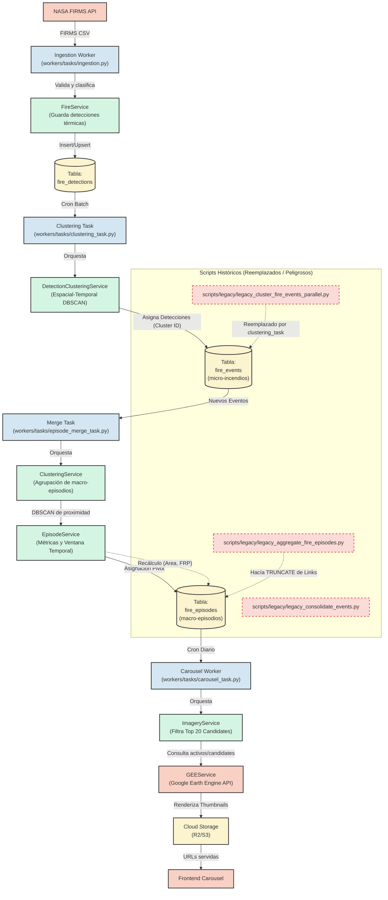

# indice de documentacion

Ultima actualizacion: 22 de febrero de 2026.

Este indice separa documentacion vigente (canonica) de documentacion historica (archivo).

## documentacion canonica actual

### producto

- `docs/product/README.md` - hub canonico de producto
- `docs/product/casos-de-uso-y-estado.md` - fuente unica de casos de uso y estado
- `docs/product/estado-real-del-producto.md` - semaforo de estado y top 5 de cierre
- `docs/product/diferenciacion-mercado.md` - relevamiento externo con citas
- `docs/product/matriz-inconsistencias-2026-02-22.md` - diagnostico de consistencia

### flujos CORE (datos → UI)

- `docs/core-flows/README.md` - mapa de documentos por flujo CORE
- `docs/core-flows/core-ingesta/core-ingesta-overview.md` - ingesta FIRMS → fire_detections/fire_events
- `docs/core-flows/core-preproceso-imagenes/core-preproceso-overview.md` - thumbnails, watermark y fixes PNG
- `docs/core-flows/core-vae-ucf12-ndvi/core-vae-overview.md` - VAE / UC‑F12 / NDVI
- `docs/core-flows/core-inferencia-y-hd/core-inferencia-overview.md` - recurrencia, calidad, exploracion HD
- `docs/core-flows/core-ui-analisis/core-ui-overview.md` - UI de analisis, mapas y capas
- `docs/core-flows/core-pipeline-e2e/core-pipeline-overview.md` - pipeline end‑to‑end de datos

### experiencia frontend

- `docs/frontend/README.md` - rutas, estado por pantalla y caveats
- `docs/frontend/routing_access_ruc.md` - matriz de acceso por ruta

### contratos API y auth

- `docs/backend/api/auth_matrix.md` - matriz de autenticacion por endpoint

### infraestructura y operacion

- `docs/infrastructure/deployment/DEPLOYMENT.md` - guia de despliegue
- `docs/flujo-deploy.md` - flujo resumido de deploy y troubleshooting operativo

### referencia de marca

- `docs/brand.md` - configuracion de branding (Vestigia)

## documentacion historica (archivo)

- `docs/archive/` - roadmaps, planes tecnicos y reportes historicos migrados

Regla:

- si una ruta vieja fue migrada, el archivo original queda como puente con link al archivo y al canónico.

## reglas de lectura rapida

1. si queres entender el producto hoy: empezar por `README.md` y `docs/product/estado-real-del-producto.md`.
4. si queres validar estado real contra codigo: usar `docs/product/casos-de-uso-y-estado.md` + `docs/backend/api/auth_matrix.md`.
5. si queres contexto historico: ir a `docs/archive/`.

## Flujo de Datos y Agrupamiento (Pipeline Core)

A continuación, se detalla el ciclo de vida real de los datos desde la ignición térmica hasta la visualización en el frontend.

