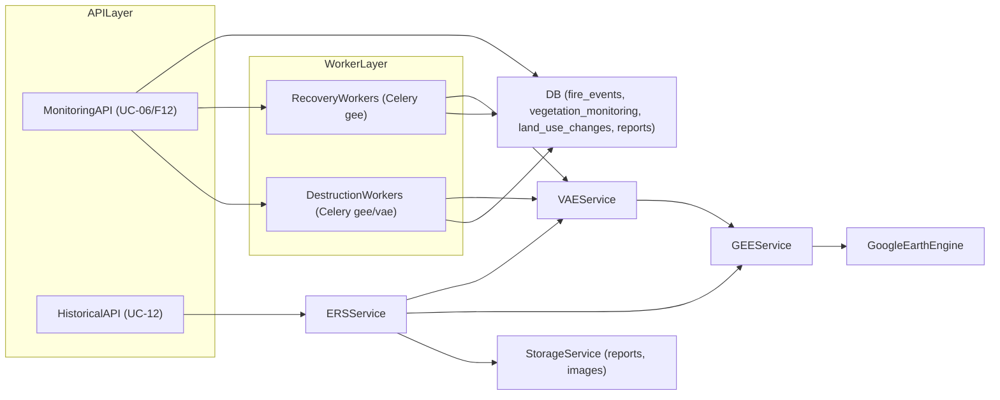
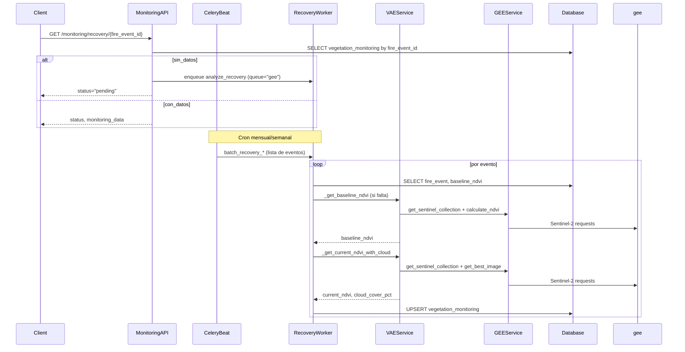
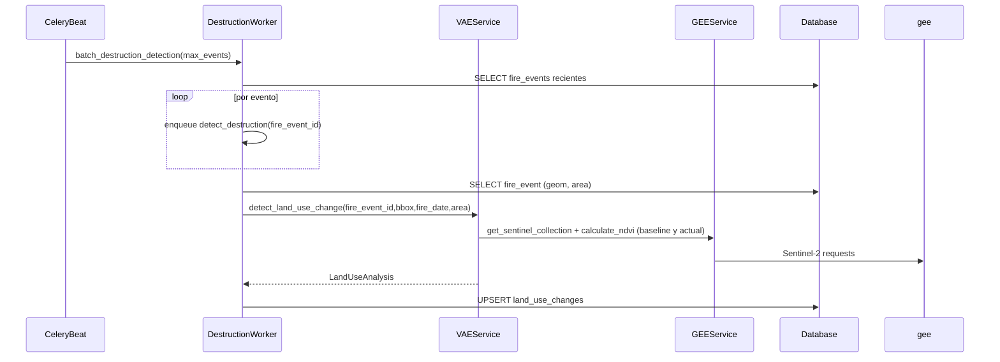
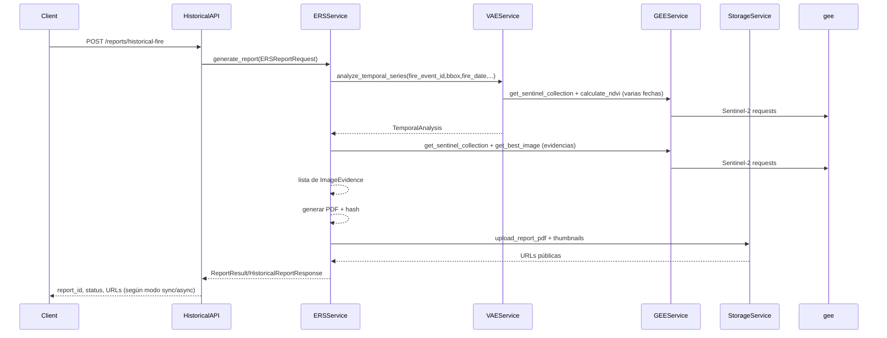

# Auditoría de flujo VAE (Vegetation Analysis Engine)

## 1. Resumen ejecutivo

El módulo **VAE (Vegetation Analysis Engine)** implementa el motor de análisis de vegetación para ForestGuard sobre Google Earth Engine (GEE). Cubre:

- **UC‑06 / UC‑F12**: monitoreo de recuperación post‑incendio vía NDVI, persistiendo en `vegetation_monitoring`.
- **UC‑08 / UC‑F12**: detección de cambios de uso de suelo y posibles violaciones, persistiendo en `land_use_changes`.
- **UC‑12**: análisis temporal histórico para reportes, consumido por `ERSService`.

El flujo está **diseñado para que ningún endpoint HTTP llame a GEE en tiempo real**: solo los workers (colas Celery) consumen GEE, populan tablas de monitoreo y la API expone resultados desde BD. Esta auditoría se centra en:

- **Arquitectura y componentes** (API, workers, VAE, GEE, ERS, BD, colas).
- **Flujos end‑to‑end** (recuperación, destrucción/cambio de uso, UC‑12).
- **Correctitud funcional** (fórmulas, clasificaciones, manejo de errores, agregaciones).
- **Persistencia/RLS/colas**.
- **Gap de tests y riesgos principales**, con una checklist de acciones sugeridas.

---

## 2. Arquitectura y componentes

### 2.1. Componentes principales

- **Capa GEE (`GEEService`)**
  - Archivo base: `app/services/gee_service.py`.
  - Responsabilidades:
    - Autenticación y rate limiting contra GEE.
    - Obtención de colecciones Sentinel‑2 (`get_sentinel_collection`).
    - Selección de la “mejor imagen” (`get_best_image`) con criterio de cobertura/nubes.
    - Cálculo de NDVI y otros índices (`calculate_ndvi`, `calculate_nbr`).
    - Generación de thumbnails y descargas (`get_thumbnail_url`, `download_thumbnail`, `get_dnbr_thumbnail_url`).
    - Series temporales para UC‑11/12 (`get_temporal_series`, `get_annual_series_for_fire`).

- **Motor VAE (`VAEService`)**
  - Archivo: `app/services/vae_service.py`.
  - Depende de: `GEEService`, `StorageService`, `gee_circuit`.
  - Responsabilidades:
    - **UC‑06**: `analyze_recovery`, `get_recovery_time_series`, `get_recovery_timeline`.
    - **UC‑08**: `detect_land_use_change`.
    - **UC‑12**: `analyze_temporal_series`.
    - Lógica de negocio: enums (`RecoveryStatus`, `LandUseChangeType`, `Severity`, `AnomalyType`), umbrales NDVI y recuperación esperada, detección de anomalías, severidad y recomendaciones.

- **Workers Celery**
  - Archivo Celery: `workers/celery_app.py`.
  - Tasks de recuperación:
    - `workers.tasks.recovery.analyze_recovery` y batchs asociados (`batch_recovery_monthly`, `batch_recovery_recent`, `batch_recovery_analysis`, `analyze_episode_recovery`, `batch_episode_recovery_analysis`) en `workers/tasks/recovery.py`.
  - Tasks de destrucción/cambio de uso:
    - `workers.tasks.destruction.detect_destruction`, `classify_land_use`, `generate_destruction_report`, `batch_destruction_detection` en `workers/tasks/destruction.py`.

- **API HTTP**
  - Endpoints de monitoreo (`UC‑06/UC‑F12`):
    - Archivo: `app/api/routes/monitoring.py`.
    - `GET /api/v1/monitoring/recovery/{fire_event_id}`.
    - `GET /api/v1/monitoring/recovery/by-episode/{episode_id}`.
    - `GET /api/v1/monitoring/recovery/summary`.
    - `GET /api/v1/monitoring/land-use-changes/{fire_event_id}`.
    - `POST /api/v1/monitoring/recovery/trigger`.
  - Endpoints de reportes históricos (`UC‑12`):
    - Archivo: `app/api/routes/historical.py`.
    - `POST /api/v1/reports/historical-fire` y endpoints de consulta/verificación.

- **ERS (Evidence Reporting Service) / UC‑12**
  - Archivo: `app/services/ers_service.py`.
  - Orquesta:
    - `VAEService.analyze_temporal_series` para análisis NDVI anual.
    - `GEEService` para obtener imágenes y thumbnails.
    - `StorageService` para PDFs y evidencias.
  - Produce `ReportResult` (PDF, viewer, hash de verificación).

- **Base de datos y modelos**
  - Migración de esquema y RLS UC‑F12: `database/migrations/2026_02_23_uc_f12_vae_monitoring.sql`.
  - Modelos ORM relevantes: `app/models/citizen.py` (clase `LandUseChange`, FK a `fire_events` y `vegetation_monitoring`).
  - Tablas clave:
    - `fire_events` (geom, fechas, área, provincia).
    - `vegetation_monitoring` (NDVI mensual y estado de recuperación).
    - `land_use_changes` (cambios de uso y violaciones).
    - Tablas de soporte UC‑12 (`satellite_images`, `fire_protected_area_intersections`, etc., usadas desde `ERSService`).

- **Infraestructura / Colas**
  - Config Celery: `workers/celery_app.py` (colas `ingestion`, `clustering`, `analysis`, `gee`, `reports`, `notification`, `vae`, `default`).
  - Orquestación Docker: `docker-compose.yml`.
    - `worker-fast`: procesa `ingestion,clustering,reports,notification,default`.
    - `worker-gee`: procesa `analysis,vae` (y es el único con credenciales GEE).
    - `celery-beat`: programa `recovery-monthly`, `recovery-weekly-recent`, `vae-*`.

### 2.2. Diagrama de componentes (alto nivel)

---

## 3. Flujos end‑to‑end

### 3.1. Flujo de recuperación NDVI (UC‑06 / UC‑F12)

**Descripción paso a paso**

1. **Disparo del análisis**
   - Automático vía Celery Beat:
     - `recovery-monthly`: `workers.tasks.recovery.batch_recovery_monthly` en cola `gee`, para eventos `active/monitoring`.
     - `recovery-weekly-recent`: `batch_recovery_recent` para eventos recientes sin análisis del mes actual.
     - `vae-episodes-weekly`: `batch_episode_recovery_analysis` para episodios del carrusel.
   - Manual:
     - `POST /api/v1/monitoring/recovery/trigger`: valida admin y encola `analyze_recovery` (y `detect_destruction`) en cola `gee`.
   - On‑demand:
     - `GET /api/v1/monitoring/recovery/{fire_event_id}` sin datos en `vegetation_monitoring` → `_enqueue_recovery_if_not_pending` encola `analyze_recovery` (cola `gee`).

2. **Worker `analyze_recovery`**
   - Lee `fire_events` para obtener:
     - `start_date` y `centroid` (lat/lon).
   - Construye `bbox` local alrededor del centroid (~1 km).
   - Intenta reutilizar `baseline_ndvi` desde `vegetation_monitoring` (cualquier registro con baseline no nulo).
   - Si no hay baseline:
     - Llama `vae._get_baseline_ndvi(bbox, fire_date)` → 1 request GEE con circuit breaker.
     - Si falla por falta de imágenes pre‑fuego (`BaselineNotAvailableError`), retorna `{"status": "pending", "reason": "no_baseline_image"}` sin escribir en BD.
   - Calcula NDVI mensual actual:
     - `target_month = first day of current month`.
     - Llama `vae._get_current_ndvi_with_cloud(bbox, target_month)` → (ndvi_mean, cloud_cover_pct).
     - Si no hay imagen utilizable (`GEEImageNotFoundError`), retorna `{"status": "pending", "reason": "no_image_this_month"}`.
   - Calcula:
     - `recovery_pct = min(100, max(0, (current_ndvi / baseline_ndvi) * 100))` (porcentaje del baseline alcanzado).
     - `recovery_status` string con `_classify_recovery` (ver sección 4.1).
     - `months_after_fire` (diferencia de meses entre `fire_date` y `target_month`).

3. **Persistencia en `vegetation_monitoring`**
   - `INSERT ... ON CONFLICT (fire_event_id, monitoring_date) DO UPDATE` sobre:
     - `ndvi_mean`, `baseline_ndvi`, `recovery_percentage`, `cloud_cover_pct`, `recovery_status`, `human_activity_detected`, `activity_type`, `updated_at`.
   - Constraint `uq_vm_event_date` garantiza idempotencia y permite múltiples encoles seguros.
   - Índices (`idx_vm_event_date`, `idx_vm_event_months`) optimizan consultas por evento y por últimos meses.

4. **Consumo por API (`GET /monitoring/recovery/{fire_event_id}`)**
   - Lee `fire_events` (fecha y centroid).
   - Consulta `vegetation_monitoring`:
     - Filtra por `fire_event_id` y `months_after_fire <= max_months`.
     - Ordena por `monitoring_date ASC`.
   - Sin filas:
     - Re‑encola `analyze_recovery`.
     - Devuelve `RecoveryResponse` con:
       - `recovery_status="pending"`, `monitoring_data=[]`.
       - Mensaje orientativo de “análisis en proceso”.
   - Con filas:
     - Construye `monitoring_data` (`MonthlyNDVI`).
     - Determina `baseline_ndvi` (primer baseline no nulo).
     - Extrae último registro:
       - `current_ndvi`, `recovery_percentage`, `human_activity_detected`, `activity_type`.
     - Deriva `recovery_status` vía `_classify_status` (ver sección 4.1).

**Diagrama de secuencia (recuperación por evento)**

---

### 3.2. Flujo de cambio de uso / destrucción (UC‑08 / UC‑F12)

**Descripción paso a paso**

1. **Disparo del análisis**
   - Automático:
     - `vae-destruction-monthly` (Celery Beat) llama `workers.tasks.destruction.batch_destruction_detection` (cola `"gee"` en configuración, ver sección 5.3).
     - Consulta `fire_events` activos/monitoring/contained < 36 meses y encola `detect_destruction` por evento (cola `'vae'` en el código de task).
   - Manual:
     - `POST /api/v1/monitoring/recovery/trigger` también encola `detect_destruction` para un fuego puntual, pero usando `queue="gee"`.

2. **Worker `detect_destruction`**
   - Lee `fire_events` (fecha, centroid, área estimada).
   - Construye `bbox` local.
   - Instancia `VAEService` y llama `detect_land_use_change`:
     - Usa `_get_baseline_ndvi` y `_get_current_ndvi`.
     - Calcula `ndvi_change`, heurísticas de cambio (`_classify_land_use_change`), severidad (`_determine_severity`), índice geométrico, etc.
   - Determina:
     - `change_type`, `change_confidence`, `is_potential_violation`, `violation_severity`.
   - UPSERT en `land_use_changes` con:
     - `ON CONFLICT (fire_event_id, change_detected_at)` actualizando tipo, severidad, áreas, flags y notas (`recommended_action`).

3. **Consumo por API**
   - `GET /api/v1/monitoring/land-use-changes/{fire_event_id}`:
     - Verifica existencia del fuego.
     - Lee `land_use_changes` ordenado por fecha.
     - Cuenta registros con `is_potential_violation=true` (violations).
     - Devuelve `LandUseChangesResponse` con lista de `LandUseChangeItem` y `violation_count`.

**Diagrama de secuencia (detección de destrucción)**

---

### 3.3. Flujo UC‑12 histórico (reportes)

**Descripción paso a paso**

1. **Disparo del reporte**
   - `POST /api/v1/reports/historical-fire` (`historical.generate_historical_report`).
   - Convierte `HistoricalReportRequest` en `ERSReportRequest` (tipo `HISTORICAL`).

2. **Orquestación ERS**
   - `ERSService.generate_report` deriva a `_generate_historical_report` para UC‑12.
   - Autentica GEE.
   - Llama `VAEService.analyze_temporal_series`:
     - Baseline NDVI pre‑incendio.
     - Serie anual post‑incendio (hasta `years_to_analyze` o hoy).
     - Calcula métricas: `overall_recovery_percentage`, `final_recovery_status`, `recovery_trend`, `images_with_anomalies`.
   - Recolecta evidencias satelitales con `GEEService`:
     - `get_sentinel_collection` + `get_best_image` + `get_thumbnail_url`/`download_thumbnail`.
     - Opcionalmente NDVI por imagen (via `calculate_ndvi`).

3. **Generación de PDF y almacenamiento**
   - `ERSService._create_historical_pdf` genera PDF con:
     - Resumen ejecutivo de recuperación (porcentaje total, estado, tendencia).
     - Imágenes pre/post‑incendio.
     - Bloque de verificación con QR y URL de verificación.
   - Calcula hash SHA‑256 del PDF (`_create_verification_hash`).
   - Sube PDF y thumbnails a `StorageService`.
   - Devuelve `ReportResult` con URLs y hash.

4. **Consulta y verificación**
   - `GET /api/v1/reports/{report_id}`:
     - Verifica existencia del PDF en storage y expone URLs (`pdf_url`, `web_viewer_url`).
   - `GET /api/v1/reports/verify/{report_id}`:
     - `ERSService.verify_report` recalcula hash desde storage y compara.

**Diagrama de secuencia (UC‑12)**

---

## 4. Correctitud funcional: fórmulas, clasificaciones y errores

### 4.1. Métricas de recuperación y clasificaciones

**Fórmula principal de recuperación**

- En `VAEService.analyze_recovery`:
  - `recovery_percentage = (current_ndvi / baseline_ndvi) * 100` (recortado a \[0, 100]).
  - Documentado explícitamente como:
    - “**porcentaje del baseline alcanzado**”, **no** “porcentaje recuperado desde el nadir post‑incendio”.
  - Ejemplo en docstring:
    - baseline = 0.6, nadir = 0.1, actual = 0.35 → 58% del baseline vs 50% de recuperación real desde nadir.
  - La fórmula “desde el nadir” está identificada como **deuda técnica futura**.

**Clasificación interna en VAE**

- `VAEService._classify_recovery_status` mapea `recovery_pct` a `RecoveryStatus`:
  - `< 10%` → `NOT_STARTED`.
  - `10–30%` → `EARLY_RECOVERY`.
  - `30–60%` → `MODERATE_RECOVERY`.
  - `60–90%` → `ADVANCED_RECOVERY`.
  - `> 90%` → `FULL_RECOVERY`.
  - Cualquier anomalía → fuerza `ANOMALY_DETECTED`.
- `VAEService._detect_recovery_anomaly` marca anomalías cuando:
  - `months_after > 12` y `recovery_pct < 20` → `NO_RECOVERY`.
  - `current_ndvi < baseline_ndvi * 0.3` → `SUDDEN_DROP`.
  - `months_after < 6` y `recovery_pct > 80` → `RAPID_GREENING`.
  - `recovery_pct` muy por debajo de lo esperado (`< 50%` de lo esperado) → `NO_RECOVERY`.

**Clasificación en workers y API**

- Worker `workers.tasks.recovery._classify_recovery` (string para BD/API):
  - Si `baseline` y `current >= 0.95 * baseline` → `full_recovery`.
  - Si `pct >= 80` → `advanced_recovery`.
  - Si `pct >= 50` → `moderate_recovery`.
  - Si `pct >= 20` → `early_recovery`.
  - Si `pct >= 0` → `stalled`.
  - Else → `not_started`.
- API `monitoring._classify_status` (para UI):
  - Si `has_activity` → `anomaly_detected`.
  - Si `recovery_pct` es `None` → `pending`.
  - Si `>= 90` → `full_recovery`.
  - Si `>= 70` → `advanced_recovery`.
  - Si `>= 40` → `moderate_recovery`.
  - Si `>= 10` → `early_recovery`.
  - Si `>= 0` → `stalled`.
  - Else → `not_started`.

**Conclusiones de correctitud**

- Hay **consistencia conceptual** (rangos crecientes de recuperación), pero:
  - Los umbrales numéricos difieren **ligeramente** entre:
    - Enum `RecoveryStatus` (10/30/60/90) en VAE.
    - `_classify_recovery` en worker (0/20/50/80/95%).
    - `_classify_status` en API (0/10/40/70/90%).
  - Esto puede provocar pequeñas diferencias de etiqueta en fronteras (ej. 42% puede ser `early` o `moderate` según contexto).
- Para UC‑F12, lo **determinante para la UI** es `_classify_status`, por lo que cualquier cambio de umbral debería revisarse de punta a punta (VAE, worker, API y diseño de badges en frontend).

### 4.2. Heurísticas de cambio de uso de suelo y severidad

**Clasificación de cambio de uso (`_classify_land_use_change`)**

- Casos principales:
  - `current_ndvi < bare_soil (0.1)` y `months_after > 12` → `CONSTRUCTION` (0.7).
  - `current_ndvi < sparse_vegetation (0.2)` y `months_after > 18` → `BARE_SOIL` (0.6).
  - `months_after < 6` y `current_ndvi / baseline_ndvi > 1.2` → `AGRICULTURE` (0.6).
  - Si `recovery_pct > expected * 0.7` → `NATURAL_RECOVERY` (0.8).
  - Si nada aplica → `UNCERTAIN` (0.4).

**Severidad (`_determine_severity`)**

- Base según tipo:
  - `CONSTRUCTION`, `MINING`, `DEFORESTATION` → `CRITICAL`.
  - `ROADS`, `AGRICULTURE` → `HIGH`.
  - `BARE_SOIL` → `MEDIUM`.
  - `UNCERTAIN` → `LOW`.
- Ajustes:
  - Si `confidence < 0.5` → baja un nivel.
  - Si `area_hectares > 50` → sube un nivel.

**Índice geométrico y recomendación**

- `_estimate_geometric_index`:
  - Usa solo magnitud de cambio de NDVI como proxy de “artificialidad”.
  - Cambio muy drástico y NDVI muy bajo → ~0.7 (posible construcción).
  - Cambios moderados → ~0.4.
  - Cambios pequeños → ~0.1.
- `_get_recommended_action`:
  - `NATURAL_RECOVERY` → “Continuar monitoreo estándar”.
  - `CRITICAL` → notificación urgente a autoridades (Ley 26.815).
  - `HIGH` → verificación en terreno en 30 días.
  - `requires_verification` → recomendación explícita de verificar.

**Conclusiones de correctitud**

- La lógica es **coherente pero fuertemente heurística**:
  - Combina NDVI relativo al baseline, meses desde el incendio y área total.
  - No hay separación clara entre “destrucción total” vs “reconversión productiva” más allá de etiquetas como `AGRICULTURE`/`CONSTRUCTION`.
- Sin un conjunto de **casos de prueba de referencia**, es difícil validar que los umbrales (p.ej. 1.2× baseline para agricultura) reflejen correctamente la realidad en todas las provincias y ecosistemas.

### 4.3. Manejo de errores, estados `pending` y GEE

- **Errores de baseline**:
  - Falta de imagen pre‑fuego (`BaselineNotAvailableError`) resulta en:
    - `analyze_recovery` retornando `{"status": "pending", "reason": "no_baseline_image"}` sin persistir fila.
    - API `GET /monitoring/recovery/{id}` ve 0 filas y re‑encola jobs, exponiendo `status="pending"`.
- **Falta de imágenes mensuales**:
  - `GEEImageNotFoundError` para el mes actual → `{"status": "pending", "reason": "no_image_this_month"}`.
  - Runbook (`core-vae-runbook.md`) indica que en esos casos se debe aceptar `pending` como estado final y comunicar “No hay datos NDVI disponibles” en UI.
- **Circuit breaker**:
  - Tanto `_get_baseline_ndvi` como `_get_current_ndvi*` están envueltos en `gee_circuit`; si el circuito está abierto se lanza `GEEServiceUnavailableError`.
  - Workers manejan errores genéricos con reintentos y, tras agotar reintentos, envían a DLQ vía `DlqTask`.

**Riesgos detectados**

- Eventos con condiciones crónicas (sin imágenes pre‑fuego o sin ventanas mensuales válidas) pueden quedar en estado “pending” indefinido, con reintentos periódicos.
- No hay diferenciación a nivel API entre:
  - “pending por análisis en cola” vs “pending definitivo por falta de datos GEE”.

### 4.4. Agregaciones por episodio y summary

- **`GET /monitoring/recovery/by-episode/{episode_id}`**:
  - Agrega `AVG(ndvi_mean)`, `AVG(recovery_percentage)`, `AVG(baseline_ndvi)` y `AVG(cloud_cover_pct)` por mes calendario para todos los eventos del episodio.
  - Restricción de rango:
    - `vm.monitoring_date >= episode.start_date`.
    - `<= episode.start_date + max_months`.
  - `months_after_fire` se reinterpreta como meses desde el inicio del episodio, no por evento individual.
- **`GET /monitoring/recovery/summary`**:
  - usa `LATERAL JOIN` para obtener la última fila de `vegetation_monitoring` por evento.
  - Clasifica estados vía `_classify_status`, marca `anomaly_detected` cuando hay `human_activity_detected` o `activity_type` sospechosa.

**Riesgos detectados**

- Al promediar por episodio, eventos con pocas observaciones pueden pesar igual que eventos muy monitoreados.
- `max_months` y rangos de fechas de `episode.start_date` pueden excluir datos válidos si:
  - el episodio se crea más tarde que algunos incendios que lo integran.

---

## 5. Persistencia, RLS y colas

### 5.1. Esquema e idempotencia

Según `2026_02_23_uc_f12_vae_monitoring.sql`:

- `vegetation_monitoring`:
  - `UNIQUE (fire_event_id, monitoring_date)` → idempotencia para `analyze_recovery`.
  - Índices:
    - `(fire_event_id, monitoring_date)`.
    - `(fire_event_id, months_after_fire DESC)`.
- `land_use_changes`:
  - `UNIQUE (fire_event_id, change_detected_at)` → idempotencia para `detect_destruction`.
  - `monitoring_record_id` con FK a `vegetation_monitoring(id)`.
- Workers usan consistentemente `INSERT ... ON CONFLICT ... DO UPDATE` para ambos flujos → la topología es robusta a reintentos y disparos repetidos.

### 5.2. RLS y permisos

- `ALTER TABLE vegetation_monitoring ENABLE ROW LEVEL SECURITY`.
  - Política `auth_read_vegetation`: `SELECT TO authenticated USING (true)` → cualquier usuario autenticado puede leer.
  - Política `system_write_vegetation`: `FOR ALL TO service_role` → solo workers (service key) pueden escribir.
- `ALTER TABLE land_use_changes ENABLE ROW LEVEL SECURITY`.
  - Política `auth_read_land_use`: `SELECT TO authenticated`.
  - Política `system_write_land_use`: `FOR ALL TO service_role`.

**Conclusiones**

- El modelo de seguridad asume que:
  - La API de monitoreo/UC‑12 se conecta a Supabase con rol de **service_role** cuando escribe, y con **authenticated** (via JWT) cuando expone datos a la UI.
  - Cualquier cambio de claves Supabase o conexión directa a la BD debe respetar este modelo, o los workers pueden fallar silenciosamente por `permission denied`.

### 5.3. Topología de colas Celery

- `workers/celery_app.py`:
  - `task_routes`:
    - `'workers.tasks.recovery.*'` → cola `'gee'`.
    - `'workers.tasks.destruction.*'` → cola `'gee'`.
  - Beat:
    - `recovery-monthly`, `recovery-weekly-recent`, `vae-recovery-monthly` → `options: {'queue': 'gee'}`.
    - `vae-destruction-monthly`, `vae-episodes-weekly` → también `'gee'`.
- **Decoradores de tasks**:
  - `workers.tasks.recovery.analyze_recovery`: `queue="gee"`.
  - `workers.tasks.destruction.detect_destruction` y `batch_destruction_detection`: `queue='vae'`.
  - Chord en `generate_destruction_report`: subtareas y callback con `.set(queue='vae')`.
- **Workers en `docker-compose.yml`**:
  - `worker-fast`:
    - `--queues=ingestion,clustering,reports,notification,default`.
  - `worker-gee`:
    - `--queues=analysis,vae`.
  - No hay ningún worker que escuche explícitamente la cola `'gee'` por nombre.

**Riesgo de configuración**

- En la teoría del código:
  - `gee` se usa como cola lógica de tareas que consumen GEE.
  - `vae` se usa como cola “de análisis VAE”.
- En la práctica actual de docker:
  - Solo existe un worker con credenciales GEE (`worker-gee`) en colas `analysis,vae`.
  - Tasks que se encolen en `'gee'` y no opten explícitamente por `queue='vae'` pueden **no ser consumidas** por ningún worker.
- Se observan mitigaciones parciales:
  - `detect_destruction` se declara con `queue='vae'` y chords usan `.set(queue='vae')`.
  - Sin embargo, endpoints como `trigger_recovery_analysis` usan explícitamente `queue="gee"` para `detect_destruction`, lo que requiere que algún worker consuma también esa cola.

---

## 6. Gap de tests automatizados y propuesta mínima

### 6.1. Situación actual

- Búsquedas en `tests/` no muestran:
  - Referencias a `VAEService`.
  - Uso explícito de `vegetation_monitoring` o `land_use_changes`.
  - Tests para `workers.tasks.recovery` o `workers.tasks.destruction`.
- La validación actual de VAE se apoya principalmente en:
  - Runbooks y specs (`core-vae-*`, `UC_F12_*`, `analisis_ndvi.md`).
  - Scripts y verificaciones manuales (`docs/archive/ndvi-uf12/uc-f12-testing-and-manual-workers.md`).

### 6.2. Suite mínima recomendada

**A. Unit tests de `VAEService` (sin GEE real)**

- Mock de `GEEService` para devolver NDVI conocidos:
  - Casos para `analyze_recovery`:
    - `baseline > 0`, `current << baseline` → `NOT_STARTED`/`stalled`.
    - `baseline > 0`, `current ~ baseline` → `FULL_RECOVERY`.
    - Escenarios con anomalías: `NO_RECOVERY`, `SUDDEN_DROP`, `RAPID_GREENING`.
  - Casos para `detect_land_use_change`:
    - Bajo NDVI persistente > 12 meses → `CONSTRUCTION`.
    - NDVI muy bajo > 18 meses → `BARE_SOIL`.
    - NDVI post‑incendio > baseline temprano → `AGRICULTURE`.
  - Casos de `_get_expected_recovery` y `_calculate_trend`.

**B. Tests de workers (con BD de prueba o fixtures)**

- `workers.tasks.recovery.analyze_recovery`:
  - Inserta un `fire_events` sintético con centroid y fecha.
  - Verifica que tras ejecutar la task se crea/actualiza la fila en `vegetation_monitoring` con:
    - `months_after_fire` esperado.
    - `recovery_percentage` consistente con mocks de VAE.
  - Casos de error:
    - baseline no disponible → sin filas nuevas y `status=pending`.
    - sin imagen para el mes actual.
- `workers.tasks.destruction.detect_destruction`:
  - Verifica UPSERT en `land_use_changes` y mapeo correcto de `LandUseAnalysis` a columnas (tipo, severidad, notas).

**C. Tests de API**

- `GET /monitoring/recovery/{fire_event_id}`:
  - Sin datos → `pending` + encolado de worker (puede testearse con mock a Celery).
  - Con datos normales → `recovery_status` y `monitoring_data` consistentes con filas.
  - Con `human_activity_detected` o `activity_type` sospechosa → `recovery_status="anomaly_detected"`.
- `GET /monitoring/land-use-changes/{fire_event_id}`:
  - Casos con y sin violaciones (`is_potential_violation`) para validar `violation_count`.

---

## 7. Matriz de riesgos y checklist de acciones

### 7.1. Matriz de riesgos de correctitud funcional

| ID  | Riesgo                                                                 | Impacto          | Probabilidad | Comentario clave                                                         |
|-----|------------------------------------------------------------------------|------------------|-------------|---------------------------------------------------------------------------|
| R1  | **Colas `gee`/`vae` no alineadas con workers**                        | Alto (jobs no corren) | Media       | Config actual de Celery vs `docker-compose` no garantiza consumo de `gee`. |
| R2  | **Ausencia de tests específicos de VAE**                               | Alto             | Alta        | Cualquier refactor en VAE/workers/API puede introducir regresiones silenciosas. |
| R3  | **Fórmula de `recovery_percentage` ambigua (baseline vs nadir)**      | Medio/Alto       | Media       | Métrica puede malinterpretarse por usuarios y en reportes UC‑12.        |
| R4  | **Umbrales divergentes entre VAE, workers y API**                     | Medio            | Media       | Etiquetas distintas en fronteras (40%, 70%, 80%, 90%) según contexto.    |
| R5  | **Eventos en `pending` permanente por falta de imágenes GEE**         | Medio            | Media       | Sin diferenciación clara entre “en cola” vs “sin datos disponibles”.     |
| R6  | **Heurísticas de land‑use con umbrales fijos sin dataset de verdad**  | Alto (legales)   | Media       | Cambios mínimos en lógica pueden re-etiquetar violaciones críticas.     |
| R7  | **Dependencia fuerte de RLS/service_role para escritura**             | Medio/Alto       | Media       | Misconfiguración de Supabase puede romper flujos de workers sin visibilidad inmediata. |
| R8  | **Agregaciones por episodio con sesgo**                                | Medio            | Baja/Media  | Episodios con muchos/pocos eventos se promedian igual; puede confundir dashboards. |

### 7.2. Checklist priorizada de acciones recomendadas

1. **Alinear colas Celery con workers reales (R1)**
   - Definir explícitamente qué colas procesa `worker-gee`:
     - O bien incluir también `gee` en `--queues` del worker.
     - O bien cambiar `task_routes`/decoradores para que todas las tareas GEE usen solo `analysis`/`vae`.
   - Revisar `trigger_recovery_analysis` para que use la(s) cola(s) realmente consumidas.

2. **Introducir suite mínima de tests automáticos de VAE y workers (R2)**
   - Implementar la suite propuesta en la sección 6 (unit tests de `VAEService`, tests de workers y endpoints).
   - Convertir los casos del runbook UC‑F12 en fixtures de prueba (incluyendo escenarios de cuotas y fallos GEE).

3. **Formalizar la semántica de `recovery_percentage` en la UI y docs (R3, R4)**

   - Decidir explícitamente si:
     - Se mantiene la métrica actual (porcentaje del baseline alcanzado) y se actualiza toda la documentación/UI para llamarla así.
     - O se migra a una métrica de “recuperación desde el nadir” y se ajusta la fórmula en VAE + worker + API de forma coordinada.
   - Unificar los umbrales de clasificación a nivel:
     - Enum `RecoveryStatus`.
     - Worker `_classify_recovery`.
     - API `_classify_status` y frontend.

4. **Mejorar la gestión de estados `pending` y errores GEE (R5)**

   - Distinguir en `vegetation_monitoring` (o en la API) entre:
     - `pending_in_queue` (job en progreso).
     - `no_baseline_image` / `no_image_this_month` “finales”.
   - Actualizar la respuesta de API para comunicar claramente estos estados al frontend.

5. **Revisar y documentar heurísticas de land‑use con ejemplos concretos (R6)**

   - Recopilar un pequeño dataset de casos reales de:
     - Construcción, caminos, agricultura, deforestación, recuperación natural.
   - Validar reglas en `_classify_land_use_change`, `_determine_severity`, `_estimate_geometric_index` frente a estos ejemplos.
   - Añadir tests que fijen estos comportamientos para evitar regresiones futuras.

6. **Verificar configuración de RLS y claves Supabase para workers (R7)**

   - Validar en entorno real que:
     - Workers se conectan con `service_role` y pueden escribir en `vegetation_monitoring`/`land_use_changes`.
     - La API pública usa tokens `authenticated` para lectura.
   - Añadir un health‑check extendido o script de verificación que ejecute una inserción y lectura de prueba controlada.

7. **Explícitar limitaciones de agregaciones por episodio y summary (R8)**

   - Documentar en `core-vae-design`/`analisis_ndvi.md` las limitaciones de:
     - Promedios por episodio.
     - Resumen multi‑evento.
   - Evaluar, si se vuelve crítico, la introducción de:
     - Pesos por área/incendio.
     - Indicadores adicionales (p.ej. “porcentaje de superficie monitoreada con recuperación ≥ X%”).

---

Este documento consolida la arquitectura actual del módulo VAE, sus flujos principales y los puntos más frágiles desde el punto de vista de **correctitud funcional**. A partir de esta base, las siguientes iteraciones deberían enfocarse en:

- Cerrar los gaps de tests.
- Alinear colas/infraestructura con la intención de diseño.
- Refinar fórmulas y heurísticas con datos reales y feedback de negocio/jurídico.

