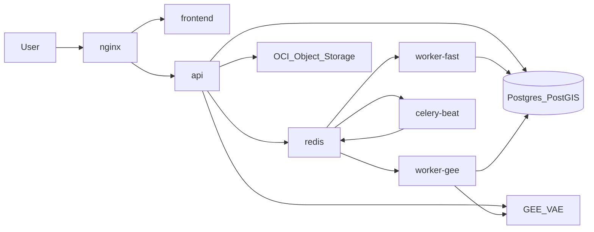

## Arquitectura de contenedores y workers

Este documento resume **todos los servicios definidos en `docker-compose.yml`** y cómo se relacionan entre sí, con la base de datos y con servicios externos.

- **Orquestador**: Docker Compose (`docker-compose.yml` + `docker-compose.ssl.yml` para el setup inicial de SSL).
- **Servicios principales**:
  - `redis` (`forestguard-redis`)
  - `api` (`forestguard-api`)
  - `worker-fast` (`forestguard-worker-fast`)
  - `worker-gee` (`forestguard-worker-gee`)
  - `celery-beat` (`forestguard-celery-beat`)
  - `flower` (`forestguard-flower`, profile `debug`)
  - `frontend` (`forestguard-frontend`)
  - `nginx` (`forestguard-nginx`)
  - `certbot` (`forestguard-certbot`, profile `ssl`)

Para detalle por servicio ver:

- `docs/containers/backend-api.md`
- `docs/containers/workers.md`
- `docs/containers/frontend-and-proxy.md`
- `docs/containers/infra-support.md`

## Servicios definidos en `docker-compose.yml`

### `redis` (`forestguard-redis`)

- **Rol**: broker y result backend de Celery; también caché ligera.
- **Imagen**: `redis:7-alpine`.
- **Persistencia**: volumen `redis_data:/data`.
- **Usado por**: `api`, `worker-fast`, `worker-gee`, `celery-beat`, `flower`.

### `api` (`forestguard-api`)

- **Rol**: API FastAPI principal del backend.
- **Imagen**: `ghcr.io/nicolasgh91/wildfire-recovery-argentina/api:latest`.
- **Dockerfile**: `Dockerfile.api` (multi-stage build sobre `Dockerfile.base`).
- **Expone**: puerto `8000` (`http://localhost:8000`), healthcheck `/health`.
- **Depende de**:
  - `redis` (Celery broker/backend).
  - Base de datos PostgreSQL/PostGIS remota (por `DB_HOST`, `DB_PORT`, `DB_NAME`, `DB_USER`, `DB_PASSWORD`).
  - Storage OCI (envs `STORAGE_*`, `OCI_*`).
  - Google Earth Engine (envs `GEE_*`).
  - Supabase (envs `SUPABASE_*`).
- **Flujo de datos**:
  - Entrada: requests HTTP desde `nginx` (frontend o clientes externos).
  - Salida:
    - Respuestas JSON.
    - Escritura/lectura de datos en la base de datos.
    - Encolado de tareas Celery en Redis (workers).
    - Lectura/escritura de assets en storage OCI.

Más detalle funcional: `docs/containers/backend-api.md`.

### `worker-fast` (`forestguard-worker-fast`)

- **Rol**: Celery worker para tareas “rápidas”:
  - Ingesta FIRMS.
  - Clustering de detecciones y episodios.
  - Generación de reportes y exports.
  - Notificaciones.
  - Tareas en cola `default`.
- **Imagen**: `ghcr.io/nicolasgh91/wildfire-recovery-argentina/worker:latest`.
- **Dockerfile**: `Dockerfile.worker` (basado en `Dockerfile.base`).
- **Colas que consume**: `ingestion`, `clustering`, `reports`, `notification`, `default`.
- **Flujo de datos**:
  - Lee mensajes desde Redis (colas anteriores).
  - Opera sobre tablas como `fire_events`, `fire_episodes`, `vegetation_monitoring`, tablas de reportes, etc.
  - Puede leer/escribir assets en storage OCI.

### `worker-gee` (`forestguard-worker-gee`)

- **Rol**: Celery worker para tareas GEE/VAE y análisis intensivo:
  - Recuperación de vegetación (`workers.tasks.recovery`).
  - Detección de destrucción (`workers.tasks.destruction`).
  - Carousel satelital y enriquecimiento geográfico.
- **Imagen**: `ghcr.io/nicolasgh91/wildfire-recovery-argentina/worker:latest`.
- **Dockerfile**: `Dockerfile.worker`.
- **Colas que consume**: `analysis`, `vae` (y tareas enrutadas a `gee` en la configuración de Celery).
- **Flujo de datos**:
  - Lee eventos/episodios desde la base de datos.
  - Llama a Google Earth Engine / VAE para obtener imágenes y métricas NDVI.
  - Escribe resultados en tablas como `vegetation_monitoring`, tablas de episodios y carrouseles.

### `celery-beat` (`forestguard-celery-beat`)

- **Rol**: scheduler de tareas periódicas Celery.
- **Imagen**: `ghcr.io/nicolasgh91/wildfire-recovery-argentina/worker:latest`.
- **Dockerfile**: `Dockerfile.worker`.
- **Tareas que agenda** (según `workers/celery_app.py`):
  - Ingesta diaria de FIRMS.
  - Clustering diario de detecciones y episodios.
  - Generación de carrousel.
  - Generación de closure reports.
  - Limpieza de assets expirados.
  - Cierre de episodios extinguidos.
  - Lotes periódicos de recuperación y destrucción (UC-F12).

### `flower` (`forestguard-flower`)

- **Rol**: dashboard de monitoreo de Celery.
- **Imagen**: `ghcr.io/nicolasgh91/wildfire-recovery-argentina/worker:latest`.
- **Dockerfile**: `Dockerfile.worker`.
- **Profile**: `debug` (solo se levanta con `--profile debug`).
- **Expone**: puerto `5555`, healthcheck `/healthcheck`.
- **Flujo de datos**: solo lee metadatos de tareas desde Redis.

### `frontend` (`forestguard-frontend`)

- **Rol**: SPA de Vestigia (React + Vite), servida por Nginx.
- **Imagen**: `ghcr.io/nicolasgh91/wildfire-recovery-argentina/frontend:latest`.
- **Dockerfile**: `frontend/Dockerfile` (build Vite + stage `nginx:alpine`).
- **Depende de**: `api`.
- **Flujo de datos**:
  - Entrada: peticiones HTTP del usuario vía `nginx`.
  - Salida: HTML/JS/CSS estático y llamadas a la API.

### `nginx` (`forestguard-nginx`)

- **Rol**: reverse proxy HTTP/HTTPS.
- **Imagen**: `nginx:alpine`.
- **Config**:
  - Monta `./nginx.conf` como configuración principal.
  - Monta `./certbot/conf` y `./certbot/www` para SSL.
- **Depende de**: `api`, `frontend`.
- **Flujo de datos**:
  - Entrada: tráfico desde internet en puertos `80` y `443`.
  - Salida: proxy hacia `frontend` y `api`.

### `certbot` (`forestguard-certbot`)

- **Rol**: emisión/renovación de certificados SSL (one-shot).
- **Imagen**: `certbot/certbot:latest`.
- **Profile**: `ssl`.
- **Config**: comparte volúmenes `./certbot/conf` y `./certbot/www` con `nginx`.
- **Flujo de datos**:
  - Se comunica con Let’s Encrypt/ACME para emitir certificados.
  - Escribe certificados y claves en `./certbot/conf`.

Más detalle operativo en `docs/SSL_SETUP.md`.

## Perfiles y entornos

- `flower` solo se ejecuta bajo **profile `debug`**:
  - `docker compose --profile debug up -d flower`
- `certbot` solo se ejecuta bajo **profile `ssl`** (emisión/renovación manual de certificados).

No hay múltiples archivos de compose por entorno (dev/prod); la misma definición se usa para producción y para entornos de prueba controlados, variando por `.env`.

## Diagrama de alto nivel

Vista simplificada de tráfico HTTP y procesamiento de tareas:

