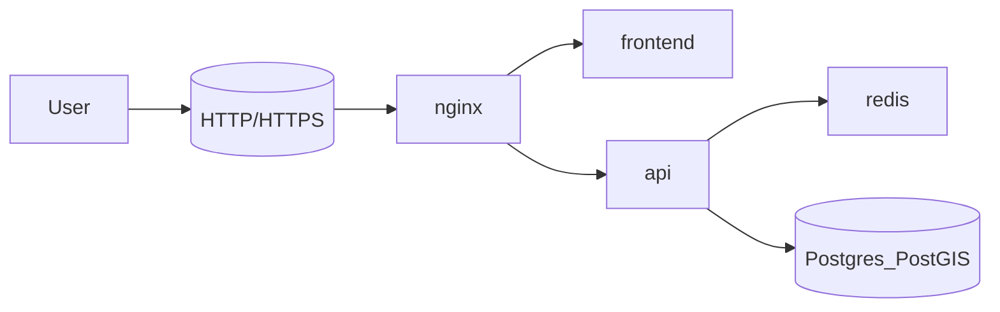

## Contenedor `frontend` (`forestguard-frontend`)

El contenedor `frontend` sirve la SPA de Vestigia (React + Vite) ya build-eada, usando Nginx como servidor estático.

- **Servicio Compose**: `frontend`
- **Nombre de contenedor**: `forestguard-frontend`
- **Imagen**: `ghcr.io/nicolasgh91/wildfire-recovery-argentina/frontend:latest`
- **Dockerfile**: `frontend/Dockerfile`

### Construcción de la imagen

El `frontend/Dockerfile` usa un build multi-stage (Node → Nginx):

- Stage de build:
  - Node 20.
  - Ejecuta `npm install` y `npm run build` (Vite).
  - Usa variables `VITE_*` (por ejemplo `VITE_API_BASE_URL`, `VITE_SUPABASE_URL`, `VITE_SUPABASE_ANON_KEY`, `VITE_API_KEY`, `VITE_SENTRY_DSN`).
- Stage final:
  - Basado en `nginx:alpine`.
  - Copia el contenido de `dist` al root de Nginx (`/usr/share/nginx/html`).

### Configuración en `docker-compose.yml`

- Depende de: `api`.
- Conectado a la red `forestguard`.
- Memoria limitada (por ejemplo `mem_limit: 32m`).
- No expone puertos directamente al host (la exposición se hace a través de `nginx`).

### Flujos de datos

- Entrada:
  - Peticiones HTTP desde el usuario final a través de `nginx`.
- Salida:
  - HTML/JS/CSS estático.
  - Requests HTTP hacia la API (`api`) y hacia Supabase (según configuración de `VITE_*`).

## Contenedor `nginx` (`forestguard-nginx`)

El contenedor `nginx` actúa como **reverse proxy HTTP/HTTPS**, exponiendo tanto el frontend como la API al exterior.

- **Servicio Compose**: `nginx`
- **Nombre de contenedor**: `forestguard-nginx`
- **Imagen**: `nginx:alpine`

### Puertos y volúmenes

- **Puertos**:
  - `80:80`
  - `443:443`
- **Volúmenes**:
  - `./nginx.conf:/etc/nginx/nginx.conf:ro`
  - `./certbot/conf:/etc/letsencrypt`
  - `./certbot/www:/var/www/certbot`

### Dependencias

- Depende de:
  - `api`
  - `frontend`
- Usa los archivos de certificados compartidos con el contenedor `certbot`.

### Flujos de datos

- Entrada:
  - Tráfico HTTP/HTTPS de usuarios externos.
- Salida:
  - Proxy hacia:
    - `frontend` (SPA estática).
    - `api` (FastAPI).
- Gestión de SSL:
  - Sirve los retos ACME desde `/var/www/certbot`.
  - Usa certificados almacenados en `/etc/letsencrypt`.

Para detalles de configuración Nginx y setup SSL, ver `docs/SSL_SETUP.md`.

## Contenedor `certbot` (`forestguard-certbot`)

El contenedor `certbot` se utiliza para **emitir y renovar certificados SSL** usando Let’s Encrypt.

- **Servicio Compose**: `certbot`
- **Nombre de contenedor**: `forestguard-certbot`
- **Imagen**: `certbot/certbot:latest`
- **Profile**: `ssl`
- **EntryPoint**: `certbot` (los argumentos reales se pasan desde scripts / override `docker-compose.ssl.yml`).

### Volúmenes compartidos

- `./certbot/conf:/etc/letsencrypt`
- `./certbot/www:/var/www/certbot`

Estos volúmenes se comparten con `nginx` para:

- Servir los retos ACME (`/.well-known/acme-challenge`).
- Montar los certificados finales (`/etc/letsencrypt`).

### Uso típico (resumen)

Según `docs/SSL_SETUP.md` y `docker-compose.ssl.yml`:

- Emisión inicial (ejemplo):

```bash
docker compose --profile ssl run --rm certbot certonly ...
docker compose restart nginx
```

- Renovación (trigger desde host, usando el mismo contenedor `certbot`):

```bash
docker compose --profile ssl run --rm certbot renew
docker compose exec nginx nginx -s reload
```

## Diagrama HTTP/HTTPS simplificado



Para detalles del backend API y workers ver `docs/containers/backend-api.md` y `docs/containers/workers.md`.

