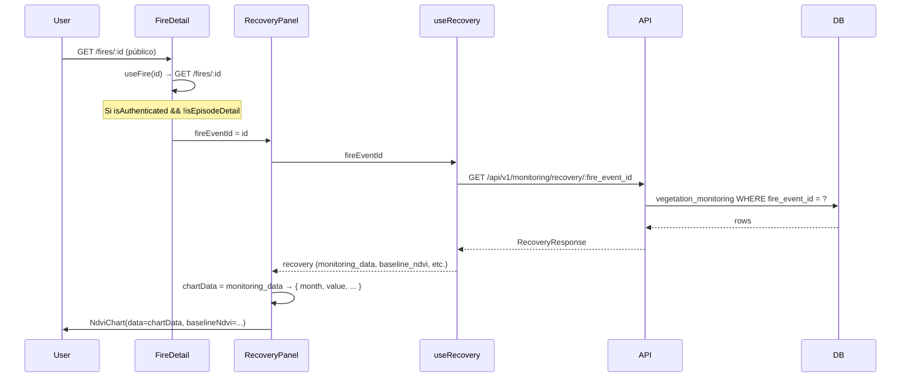

# Análisis de implementación: gráfico NDVI en /fires/:id

**Fecha:** 2026-02-26  
**Objetivo:** Disponibilidad del chart de recuperación vegetal (NDVI) en la página pública de detalle de incendio, con opciones de mejora y evaluación de impacto.

**Última revisión:** Incorpora crítica de implementación, visibilidad progresiva, riesgo de cuota GEE, corrección de interfaz del chart y hoja de ruta revisada.

---

## Crítica del análisis (revisión)

### Lo que está bien

- El diagrama de flujo es preciso y el inventario de capas está completo.
- La identificación del bloqueo de auth en el router (no en la ruta) es el diagnóstico correcto.
- La distinción entre opciones A/B/C es útil y las ventajas/limitaciones están bien caracterizadas.

### Brechas y debilidades

**1. Interfaz de `NdviChart` rota (bloqueante)**  
El componente espera `{ month: string; value: number }` pero la API devuelve `{ month: int, date: string, ndvi_mean: float, recovery_percentage?: float, cloud_cover_pct?: float }`. El chart no refleja correctamente los datos hoy ni siquiera para usuarios autenticados. Cualquier cambio de visibilidad debe ir **después** de corregir esto.

**2. Riesgo de cuota GEE no cuantificado**  
El análisis calificó el riesgo de abuso como "bajo" sin contrastarlo con el límite conocido: el timeline de recovery implica **37 llamadas GEE por request**; el free tier de GEE tiene un máximo de **1.351 requests/día**. Exponer el endpoint GET sin autenticación multiplica el riesgo de agotar cuota ante un pico de tráfico o scraping. Esto justifica **no** hacer público el GET de recovery completo y en su lugar ofrecer un snapshot liviano (sin GEE) en la respuesta ya pública de `GET /fires/:id`.

**3. Supuesto débil en la opción B (evento representativo)**  
Se asume que el "evento representativo del episodio" tiene datos en `vegetation_monitoring`. Si el episodio tiene muchos eventos, el representativo puede ser uno al que aún no se le ejecutó el análisis GEE. La UX resultante sería un panel que casi siempre muestra "pendiente" en vistas por episodio. Es preferible **agregar** datos a nivel episodio (todos los eventos del episodio con datos) en lugar de depender de un único evento representativo.

---

## 1. Cómo se obtiene la información

### 1.1 Flujo de datos actual

### 1.2 Origen de los datos

| Capa | Origen | Detalle |
|------|--------|---------|
| **Página** | `GET /fires/:id` | Público. Resuelve por evento o episodio; devuelve `source_type`, `fire`, `episode_id`, `event_count`. |
| **Panel** | `RecoveryPanel` recibe `fireEventId` | Hoy solo se renderiza si `isAuthenticated && !isEpisodeDetail`; usa el `id` de la URL. |
| **Hook** | `useRecovery(fireEventId)` | Llama a `getRecoveryTimeline(fireEventId)` → `GET /api/v1/monitoring/recovery/{fire_event_id}`. |
| **API** | [`app/api/routes/monitoring.py`](app/api/routes/monitoring.py) | `get_recovery_status(fire_event_id)`: lee `fire_events` (existencia) y `vegetation_monitoring` (NDVI por mes). Sin auth en la ruta, pero el **router** está registrado con `dependencies=[Depends(get_current_user)]` en [`app/main.py`](app/main.py) (líneas 236-241), por lo que **todos** los endpoints de monitoring exigen usuario autenticado. |
| **Backend** | Tabla `vegetation_monitoring` | Poblada por workers (VAE); por cada `fire_event_id`: `monitoring_date`, `ndvi_mean`, `baseline_ndvi`, `recovery_percentage`, etc. |

### 1.3 Cuándo hay datos para el chart

- El chart se muestra si `recovery.monitoring_data.length > 0` (y no está en estado “pending” sin datos).
- Si no hay filas en `vegetation_monitoring` para ese evento, la API devuelve `recovery_status: "pending"` y `monitoring_data: []`; el panel muestra el mensaje “Análisis de recuperación pendiente” o “No hay datos de monitoreo disponibles aún”.

---

## 2. Cuándo se muestra el chart (condiciones actuales)

| Condición | Resultado |
|-----------|-----------|
| Usuario **autenticado** | Requerido hoy para mostrar el panel (frontend). |
| Vista por **evento** (`source_type === 'event'`) | `fireId` es `fire_event_id` → la API de recovery es válida. |
| Vista por **episodio** (`source_type === 'episode'`) | Panel **no** se muestra (`!isEpisodeDetail`). Además, `fire.id` es `episode_id`; la API de recovery solo acepta `fire_event_id`, por lo que no hay ID válido para consultar. |
| Respuesta de recovery con `monitoring_data.length > 0` | Se renderiza `NdviChart` con esa serie. |
| Respuesta con `monitoring_data` vacío o `pending` | Se muestra mensaje informativo, no el gráfico. |

En resumen: el chart solo es visible para **usuarios autenticados** en la vista de **un solo evento** y cuando ya existen datos de monitoreo para ese evento.

---

## 3. Objetivo revisado: visibilidad progresiva (no binario público/privado)

La ruta `/fires/:id` es **pública**. En lugar de mostrar el chart completo a todos o a nadie, se adopta una **arquitectura de visibilidad progresiva** que da valor al anónimo sin exponer endpoints costosos (GEE) y invita a registrarse para ver el detalle.

### 3.1 Niveles de contenido propuestos

| Nivel | Usuario | Contenido visible |
|-------|---------|-------------------|
| **Público** | Anónimo | Miniatura estática: badge + un solo número (% recovery). Sin llamada a `/monitoring/recovery/*`. |
| **Registrado** | Con sesión | Chart NDVI completo + timeline (GET recovery y land-use siguen protegidos por auth). |
| **Admin** | Rol admin | Todo lo anterior + trigger manual + land-use changes. |

El snapshot público se obtiene **dentro de la respuesta ya pública** de `GET /fires/:id` (campo `recovery_snapshot`), con una sola query a `vegetation_monitoring` (último registro por evento), **sin invocar GEE**. Así el anónimo ve un dato útil y el endpoint costoso de timeline (~37 llamadas GEE por request) queda detrás de autenticación.

---

## 4. Mejoras de implementación

### Mejora 1: Snapshot liviano en GET /fires/:id (sin nuevo endpoint)

Añadir a la respuesta existente de detalle de incendio un campo opcional para la miniatura pública: `RecoverySnapshot` con `recovery_status`, `recovery_percentage`, `last_monitoring_date` (solo estos 3 campos). Incluirlo en `FireDetailResponse` como `recovery_snapshot: Optional[RecoverySnapshot] = None`. En `get_fire_detail` (y opcionalmente en `get_fire_detail_from_episode`), una sola query: `SELECT ... FROM vegetation_monitoring WHERE fire_event_id = ? ORDER BY monitoring_date DESC LIMIT 1`. Sin llamar a GEE.

### Mejora 2: Corregir NdviChart antes de cualquier cambio de visibilidad (BLOQUEANTE)

Interfaz: recibir `data: MonthlyNDVI[]`, `baselineNdvi: number`, `fireDate: string`. Transformación a series del chart dentro del componente (`date`, `ndvi`, `recovery`, `cloudCover`). Visualización: baseline dinámico (no 0.5); gradiente por zona (&lt; 0.2 rojo, 0.2–0.4 naranja, 0.4–0.6 verde claro, &gt; 0.6 verde); marcador en fecha del incendio; tooltip con `recovery_percentage` y `cloud_cover_pct` (ícono nube si &gt; 30%). Tipos Recharts: ajustar `labelFormatter` y `formatter` (ver [deuda_tecnica_ndvi_chart.md](deuda_tecnica_ndvi_chart.md)).

### Mejora 3: Vista episodio con agregación (no evento representativo)

Agregar a nivel episodio con una query del estilo: `SELECT fe.episode_id, DATE_TRUNC('month', vm.monitoring_date) AS month, AVG(vm.ndvi_mean), AVG(vm.recovery_percentage), AVG(vm.baseline_ndvi) FROM vegetation_monitoring vm JOIN fire_events fe ON fe.id = vm.fire_event_id WHERE fe.episode_id = :id GROUP BY fe.episode_id, DATE_TRUNC('month', vm.monitoring_date) ORDER BY month`. Nuevo endpoint `GET /monitoring/recovery/by-episode/{episode_id}` que devuelva `RecoveryResponse` con esta `monitoring_data` agregada. Evita el sesgo de un único evento que puede no tener datos.

### Referencia a opciones originales

- **A (descartada para Fase 1):** Hacer GET recovery público. Descartada por riesgo de cuota GEE.
- **B (reemplazada por Mejora 3):** Evento representativo puede no tener datos; preferible agregación.
- **C:** Endpoint por episodio se mantiene con **agregación** (Mejora 3).

---

## 5. Restricciones y regresiones (revisado)

### Riesgo de cuota GEE (cuantificado)

| Factor | Valor |
|--------|--------|
| Llamadas GEE por request de timeline | ~37 |
| Límite free tier GEE (referencia) | ~1.351 requests/día |
| Timelines equivalentes/día si endpoint público | 1.351 / 37 ≈ 36 por día antes de tope |

Exponer `GET /monitoring/recovery/{fire_event_id}` sin autenticación multiplica el riesgo de agotar cuota. **Conclusión:** no hacer público el GET de recovery completo; ofrecer solo el snapshot liviano en `GET /fires/:id` para el nivel público.

### Riesgos y mitigaciones (actualizado)

| Riesgo | Evaluación | Mitigación |
|--------|------------|------------|
| Cuota GEE | Alto si GET recovery es público. | Mantener GET recovery y land-use detrás de auth. Snapshot en GET /fires/:id solo lee BD, sin GEE. |
| Abuso / scraping | Medio si se abre el GET. | Rate limiting en /monitoring/recovery/* si se hace público. |
| Regresión en trigger | Alto si se desprotege. | Mantener Depends(get_current_user) y chequeo is_admin en POST /recovery/trigger. |
| Índices BD | Bajo. | Índice compuesto vegetation_monitoring(fire_event_id, monitoring_date). |

### Decisión de diseño

- GET /fires/:id: Sigue público; se enriquece con recovery_snapshot (query liviana, sin GEE).
- GET /monitoring/recovery/* y land-use-changes/*: Permanecen **privados** (auth requerida).
- Frontend: Anónimo ve badge + % desde snapshot; usuario autenticado ve chart completo (llamadas a monitoring solo con sesión).

---

## 6. Hoja de ruta revisada

- **[BLOQUEANTE]** Arreglar NdviChart: tipos alineados con MonthlyNDVI, baseline dinámico, gradiente por zonas, marcador fecha incendio, tooltip con recovery % y cloud cover. RecoveryPanel: pasar fireDate y usar interfaz corregida.
- **[DECISIÓN]** Resolver contradicción spec vs. análisis: documentar que GET monitoring permanecen privados; snapshot en GET /fires/:id para nivel público.
- **Fase 1 — Visibilidad progresiva (sin quitar auth del router):** Backend: agregar recovery_snapshot en FireDetailResponse; query en get_fire_detail (y opcionalmente en get_fire_detail_from_episode). Frontend: mostrar badge público con snapshot para todos en /fires/:id. Mostrar chart completo + timeline solo si isAuthenticated.
- **Fase 2 — Chart en vista episodio (con agregación):** Backend: GET /monitoring/recovery/by-episode/:id con agregación SQL por episodio (Mejora 3). Frontend: cuando source_type === 'episode', llamar a este endpoint (auth) y mostrar NdviChart con esa serie.
- **Transversal:** Índice compuesto en vegetation_monitoring(fire_event_id, monitoring_date). VAEService como singleton si aplica. Rate limiting en /monitoring/recovery/* si en el futuro se expone sin auth.

### 6.1 Especificación de API (visibilidad)

- **GET /api/v1/monitoring/recovery/{id}** y **GET /api/v1/monitoring/land-use-changes/{id}** son **privados**: requieren JWT (`dependencies=[Depends(get_current_user)]` en el router en `app/main.py`). No se exponen a usuarios anónimos.
- El **snapshot público** de recuperación (estado + porcentaje) se sirve únicamente en **GET /api/v1/fires/:id** en el campo **`recovery_snapshot`** (`recovery_status`, `recovery_percentage`, `last_monitoring_date`), leído de las columnas de `fire_events` (actualizadas por el trigger de G3-2) o por fallback a la última fila de `vegetation_monitoring`. No se llama a ningún endpoint de monitoring para este dato.

---

## 7. Resumen

| Aspecto | Estado actual | Tras Fase 1 (visibilidad progresiva) |
|---------|----------------|--------------------------------------|
| Anónimo en /fires/:id | No ve recuperación | Ve badge + % recovery (snapshot en GET /fires/:id) |
| Usuario autenticado | Chart completo (si evento) | Chart completo + timeline (GET recovery sigue con auth) |
| API GET recovery/land-use | Requiere auth (router) | Sin cambios (siguen con auth) |
| POST trigger | Auth + admin | Sin cambios |
| Vista episodio | Sin datos recovery | Snapshot si se agrega en backend; Fase 2: chart agregado por episodio |
| NdviChart | Interfaz rota, build falla | Corregido antes de Fase 1 (bloqueante) |

La hoja de ruta prioriza corregir el chart (bloqueante), luego implementar visibilidad progresiva sin exponer endpoints costosos, y en Fase 2 ofrecer NDVI en vista episodio mediante agregación en lugar de evento representativo.
