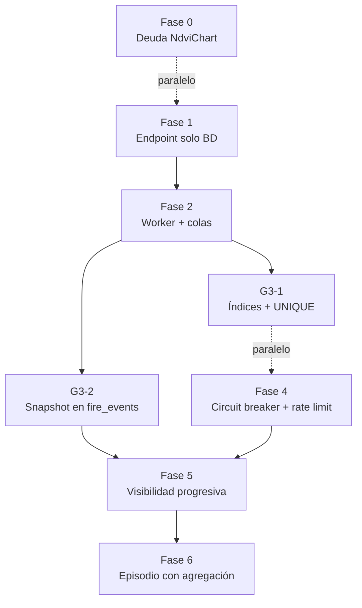

# Hoja de ruta: NDVI, GEE y deuda técnica del chart — v2

**Fecha de revisión:** 2026-02-26  
**Fuentes:**

- **Canónica (GEE):** `docs/ndvi/gee_quota_mitigation_spec.md`
- **Producto/UX:** `docs/ndvi/analisis_ndvi.md`
- **Deuda técnica:** `docs/ndvi/deuda_tecnica_ndvi_chart.md`

**Decisión de producto fijada:** Los endpoints `GET /monitoring/recovery/{id}` y `GET /monitoring/land-use-changes/{id}` son **privados** (requieren JWT). El nivel público de información de recuperación se sirve únicamente desde `GET /fires/:id` vía el campo `recovery_snapshot` (columnas en `fire_events`, sin llamar a monitoring). Esta decisión resuelve la contradicción entre el critical review y el análisis anterior.

**Orden de ejecución:**

1. Fase 0 y Fase 1 son **independientes entre sí** y pueden ejecutarse en paralelo.
2. Fase 2 depende de Fase 1 (worker necesita el contrato de BD que establece el endpoint corregido).
3. Fase 3 (G3-2 en particular) es **requisito** de Fase 5, no opcional.
4. Fase 4 puede ejecutarse en paralelo con Fase 3.
5. Fase 5 requiere Fase 3 completa (G3-2).
6. Fase 6 requiere Fase 5 completa.

---

## Fase 0 — Bloqueante: deuda técnica NdviChart

**Objetivo:** Build estable y chart alineado con la API real. Sin esto, la Fase 5 de visibilidad no puede mostrar un chart correcto.  
**Dependencia:** Ninguna. Puede ejecutarse en paralelo con Fase 1.

| ID | Tarea | Fuente | Archivos |
|----|-------|--------|---------|
| DT-1 | Corregir tipos Recharts en `ndvi-chart.tsx`: `labelFormatter` aceptar `ReactNode` (normalizar a string antes de usar); `formatter` aceptar `value: number \| undefined` y manejar el caso undefined explícitamente. | deuda_tecnica §1.1, §1.2 | `frontend/src/components/ndvi-chart.tsx` |
| DT-2 | Alinear interfaz del chart con la API real: props `data: MonthlyNDVI[]`, `baselineNdvi: number`, `fireDate: string`; transformación interna a series de Recharts (`date`, `ndvi`, `recovery`, `cloudCover`) dentro del componente (no en el hook ni en el padre). | analisis_ndvi Mejora 2, deuda_tecnica §6.1 | `ndvi-chart.tsx` |
| DT-3 | Visualización enriquecida: (a) línea de baseline dinámica usando `baselineNdvi` real, no el 0.5 hardcodeado; (b) gradiente por zonas: `< 0.2` rojo, `0.2–0.4` naranja, `0.4–0.6` verde claro, `> 0.6` verde; (c) marcador vertical en `fireDate`; (d) tooltip con `recovery_percentage` y `cloud_cover_pct` con ícono de nube si > 30%. | analisis_ndvi Mejora 2 | `ndvi-chart.tsx` |
| DT-4 | Actualizar `RecoveryPanel`: pasar `fireDate` (desde `fire.start_date` del detalle del evento) y usar la nueva interfaz de `NdviChart`; mapear `recovery.monitoring_data` al tipo `MonthlyNDVI[]`. | analisis_ndvi, deuda_tecnica | `frontend/src/components/monitoring/RecoveryPanel.tsx` |
| DT-5 | Verificación: `npm run build` sin errores de tipos en ndvi-chart ni en RecoveryPanel. | deuda_tecnica §6 | — |

---

## Fase 1 — Corrección crítica GEE: endpoint solo lee BD

**Objetivo:** `GET /monitoring/recovery/{id}` no llama GEE en ningún caso. Si no hay datos, devuelve `pending` y encola un job asíncrono. Latencia objetivo: < 100 ms.  
**Dependencia:** Ninguna. Puede ejecutarse en paralelo con Fase 0.

| ID | Tarea | Fuente | Archivos |
|----|-------|--------|---------|
| G1-1 | Reescribir `get_recovery_status`: (1) verificar evento en `fire_events`; (2) leer de `vegetation_monitoring` por `fire_event_id ORDER BY monitoring_date ASC`; (3) si no hay filas, llamar `_enqueue_recovery_if_not_pending(id)` y devolver `pending` con mensaje; (4) construir respuesta desde BD. Eliminar toda instancia de `VAEService` y `get_recovery_timeline` de esta ruta. | gee_spec §3.1 | `app/api/routes/monitoring.py` |
| G1-2 | Implementar `_enqueue_recovery_if_not_pending(fire_event_id)`: `analyze_recovery.apply_async(..., queue="gee", countdown=5)`. La tarea es idempotente (UPSERT), por lo que múltiples encoles no generan duplicados en BD. | gee_spec §3.1 | `monitoring.py` |
| G1-3 | Sanitizar mensajes de error: no exponer `str(e)` en respuestas HTTP; loguear con `error_type` y `error_msg[:500]`; respuesta 503 con mensaje genérico al usuario. | gee_spec §3.6 | `monitoring.py` |
| G1-4 | Verificación: `grep -n "VAEService\|get_recovery_timeline" app/api/routes/monitoring.py` → 0 resultados en la ruta GET. Test manual con datos en BD: respuesta en < 0.5s. | gee_spec §5.1 | — |

---

## Fase 2 — Worker GEE incremental y configuración de colas

**Objetivo:** Worker hace 1–2 requests GEE por ejecución (baseline si no existe + mes actual). UPSERT idempotente. Cola `gee` separada. Batch mensual y semanal programados.  
**Dependencia:** Fase 1 completa (contrato de BD establecido).

| ID | Tarea | Fuente | Archivos |
|----|-------|--------|---------|
| G2-1 | Reescribir `analyze_recovery`: (1) leer baseline desde `vegetation_monitoring` si ya existe; (2) si no existe, llamar `vae._get_baseline_ndvi` (1 req GEE) — propaga `BaselineNotAvailableError` sin fallback silencioso; (3) llamar `vae._get_current_ndvi_with_cloud` para mes actual (1 req GEE); (4) calcular `recovery_pct` y `recovery_status` con `_classify_recovery()`; (5) UPSERT en `vegetation_monitoring` con `ON CONFLICT (fire_event_id, monitoring_date) DO UPDATE`. Total: máximo 2 req GEE por ejecución. | gee_spec §3.2 | `workers/tasks/recovery.py` |
| G2-2 | Eliminar fallback silencioso `0.45` en `_get_baseline_ndvi`: propagar excepción custom `BaselineNotAvailableError`; el worker la captura, loguea y retorna `{"status": "pending", "reason": "no_baseline_image"}` sin reintentar (no tiene sentido reintentar si no hay imagen pre-incendio). | gee_spec §3.2, critical_review §3.2 | `app/services/vae_service.py` |
| G2-3 | Documentar la fórmula de `recovery_percentage`: la implementación actual calcula `(current / baseline) * 100`, que es "porcentaje del baseline alcanzado", no "porcentaje recuperado desde el nadir". Agregar docstring o comentario explícito en el código para evitar malinterpretaciones en la UI. Tarea de corrección de fórmula queda como deuda documentada para siguiente ciclo. | gee_spec §1.3 (nota) | `vae_service.py` |
| G2-4 | Agregar `batch_recovery_monthly`: seleccionar eventos `active/monitoring` (`LIMIT 900`), encolar `analyze_recovery` con countdown escalonado (3 s entre tasks). Límite: 900 × 2 = 1.800 req GEE ≈ 4% de la cuota diaria. | gee_spec §3.3 | `recovery.py` |
| G2-5 | Agregar `batch_recovery_recent`: eventos creados en los últimos 30 días sin análisis del mes actual (LEFT JOIN para detectar ausencia). Encolar `analyze_recovery`. | gee_spec §3.3 | `recovery.py` |
| G2-6 | Actualizar `celery_app.py` (archivo raíz, no `workers/celery_app.py`): agregar al `beat_schedule` las tareas `recovery-monthly` (día 2 de cada mes, 02:00 UTC) y `recovery-weekly-recent` (lunes 03:00 UTC); actualizar `task_routes` para enrutar `analyze_recovery`, ambos batch, `detect_destruction` y `generate_carousel` a la cola `"gee"`. | gee_spec §3.3 | `celery_app.py` (raíz) |
| G2-7 | Exponer `_get_current_ndvi_with_cloud` en `VAEService` si no existe (variante que devuelve tupla `(ndvi_mean, cloud_cover_pct)`). Usar `get_vae_service()` como singleton en workers. | gee_spec §3.2 | `vae_service.py` |

---

## Fase 3 — Índices y schema de BD

**Objetivo:** Queries rápidas en `vegetation_monitoring` e idempotencia garantizada. El campo `recovery_snapshot` en `fire_events` es **requisito** de Fase 5 (no opcional).  
**Dependencia:** Puede ejecutarse desde Fase 1 completa. G3-2 debe completarse antes de iniciar Fase 5.

| ID | Tarea | Fuente | Archivos |
|----|-------|--------|---------|
| G3-1 | Migración: índice `idx_vm_event_date` en `vegetation_monitoring (fire_event_id, monitoring_date DESC)`; índice parcial `idx_vm_event_latest` (últimos 3 meses, opcional); constraint `UNIQUE (fire_event_id, monitoring_date)` para garantizar idempotencia del UPSERT del worker. | gee_spec §4.1 | `supabase/migrations/` |
| G3-2 | Migración: añadir columnas `recovery_status VARCHAR(50)`, `recovery_percentage NUMERIC(5,2)`, `last_monitoring_date DATE` a `fire_events`. Crear trigger `trg_sync_recovery_snapshot` que actualice estas columnas en `INSERT OR UPDATE` sobre `vegetation_monitoring`. Esto permite que `GET /fires/:id` devuelva el snapshot de recuperación directamente, sin query adicional a `vegetation_monitoring` ni llamada a `/monitoring`. **Es requisito de Fase 5.** | gee_spec §4.2, analisis_ndvi Mejora 1 | `supabase/migrations/` |

---

## Fase 4 — Seguridad y resiliencia GEE

**Objetivo:** Circuit breaker para fallas GEE, rate limit en trigger admin, endpoint de salud observable.  
**Dependencia:** Puede ejecutarse en paralelo con Fase 3.

| ID | Tarea | Fuente | Archivos |
|----|-------|--------|---------|
| G4-1 | Crear `GEECircuitBreaker` con estados CLOSED/OPEN/HALF_OPEN, `failure_threshold=5`, `recovery_timeout=300` s. Instancia global `gee_circuit`. Excepción `GEECircuitOpenError` con mensaje que incluye tiempo de recuperación restante (no expone internals de GEE). | gee_spec §3.5 | `app/core/circuit_breaker.py` |
| G4-2 | Integrar `gee_circuit.call(...)` en `VAEService` para todas las llamadas a GEE (`_get_current_ndvi`, `_get_baseline_ndvi`, `compute_ndvi`). Capturar `GEECircuitOpenError` y relanzar como `GEEServiceUnavailableError`. | gee_spec §3.5 | `vae_service.py` |
| G4-3 | Rate limit en `POST /monitoring/recovery/trigger`: 10 requests/hora por IP usando `slowapi`. Respuesta 429 cuando se exceda; body con `retry_after` en segundos. | gee_spec §3.4 | `monitoring.py` |
| G4-4 | Endpoint `GET /health/gee` (admin only, `include_in_schema=False`): devolver `circuit_state`, `failure_count`, `is_healthy`, `last_failure`. | gee_spec §5.3 | `monitoring.py` o router de health |

---

## Fase 5 — Visibilidad progresiva

**Objetivo:** Tres niveles de contenido según usuario. Anónimo ve badge + % sin llamar a `/monitoring`. Autenticado ve chart completo. Admin ve todo + trigger.  
**Dependencia:** G3-2 completado (columnas y trigger en `fire_events`).

| ID | Tarea | Fuente | Archivos |
|----|-------|--------|---------|
| V1-1 | Backend: añadir `RecoverySnapshot` (`recovery_status`, `recovery_percentage`, `last_monitoring_date`) a `FireDetailResponse`. En `get_fire_detail` (y en `get_fire_detail_from_episode`): leer las nuevas columnas de `fire_events` (pobladas por el trigger de G3-2). Si el trigger no está activo aún, fallback a una query `SELECT ... FROM vegetation_monitoring WHERE fire_event_id = ? ORDER BY monitoring_date DESC LIMIT 1`. | analisis_ndvi Mejora 1, §6 | `app/schemas/fire.py`, `app/services/fire_service.py` |
| V1-2 | Frontend: tipo `FireDetailResponse` con `recovery_snapshot?: RecoverySnapshot \| null`. En `FireDetail`: mostrar badge público con estado y % recovery para **todos** los usuarios (autenticados o no) si `recovery_snapshot` existe. El badge no llama ningún endpoint de monitoring. | analisis_ndvi §3.1, §6 | `FireDetail.tsx`, tipos TS |
| V1-3 | Frontend: chart completo (`NdviChart` + métricas de `RecoveryPanel`) visible **solo si** `isAuthenticated && !isEpisodeDetail`. No quitar `dependencies=[Depends(get_current_user)]` del router de monitoring. La autenticación sigue siendo obligatoria para el timeline completo. | analisis_ndvi §5.3, §6 | `FireDetail.tsx` |
| V1-4 | Documentar: actualizar comentarios en `main.py` y en la spec de API indicando que GET monitoring son privados y que el snapshot público vive en `GET /fires/:id`. | analisis_ndvi §6 | `app/main.py`, `docs/` |

---

## Fase 6 — Chart en vista episodio con agregación

**Objetivo:** Chart NDVI en vista episodio basado en la agregación de todos los eventos del episodio (no un evento representativo arbitrario).  
**Dependencia:** Fase 5 completa.

| ID | Tarea | Fuente | Archivos |
|----|-------|--------|---------|
| V2-1 | Backend: nuevo endpoint `GET /monitoring/recovery/by-episode/{episode_id}` (auth): query agregada `JOIN vegetation_monitoring + fire_events WHERE fe.episode_id = :id GROUP BY DATE_TRUNC('month', monitoring_date)` con `AVG(ndvi_mean)`, `AVG(recovery_percentage)`, `AVG(baseline_ndvi)`. Devolver estructura compatible con `RecoveryResponse`. | analisis_ndvi Mejora 3, §6 | `monitoring.py` |
| V2-2 | Frontend: cuando `source_type === 'episode'` y usuario autenticado, llamar al endpoint de V2-1 y mostrar `RecoveryPanel` con la serie agregada. Crear `useRecoveryByEpisode(episodeId)` siguiendo el mismo patrón de `useRecovery`. Si no hay datos, mostrar mensaje coherente con el resto del panel. | analisis_ndvi §6 | `FireDetail.tsx`, nuevo hook `useRecoveryByEpisode.ts` |

---

## Verificación y tests

| ID | Tarea | Fuente |
|----|-------|--------|
| T-1 | Latencia: `GET /monitoring/recovery/{id}` con datos en BD responde en < 0.5 s. | gee_spec §5.1 |
| T-2 | Auth: `GET /monitoring/recovery/{id}` sin token → 401. Los endpoints GET de monitoring son privados (decisión de producto fijada al inicio de este documento). | gee_spec §5.1 |
| T-3 | Rate limit: `POST /monitoring/recovery/trigger` más de 10 veces/hora por IP → 429 con `retry_after`. | gee_spec §5.1 |
| T-4 | Build frontend: `npm run build` sin errores de tipos en `ndvi-chart.tsx` ni en `RecoveryPanel.tsx`. | deuda_tecnica §6 |
| T-5 | GEE aislado: `grep -n "VAEService\|get_recovery_timeline\|get_recovery_time_series" app/api/routes/monitoring.py` → 0 resultados en rutas GET. | gee_spec §5.1 |
| T-6 | Circuit breaker: simular 5 errores GEE consecutivos → estado cambia a OPEN → requests siguientes devuelven `GEECircuitOpenError` sin llamar GEE → tras 300 s estado pasa a HALF_OPEN. | gee_spec §3.5 |
| T-7 | Badge público: `GET /fires/{id}` sin token devuelve `recovery_snapshot` con `recovery_status` y `recovery_percentage` (leídos de `fire_events`, no de `vegetation_monitoring`). | analisis_ndvi Mejora 1 |
| T-8 | (Opcional) E2E: usuario anónimo en `/fires/:id` ve badge pero no chart; usuario autenticado ve chart completo en vista evento. | analisis_ndvi §6 |

---

## Diagrama de dependencias

**Notas:**
- Fases 0 y 1 pueden comenzar simultáneamente (son independientes).
- Fases 3 y 4 pueden ejecutarse en paralelo una vez completada la Fase 2.
- G3-2 es **requisito bloqueante** de Fase 5. Si se omite, no existe la columna `recovery_snapshot` en `fire_events` y el badge público no tiene de dónde leer.
- Fase 6 es la única completamente secuencial al final.

---

## Cambios respecto a la versión anterior (v1)

| # | Cambio | Razón |
|---|--------|-------|
| 1 | G3-2 pasa de "(Opcional)" a **requisito de Fase 5** | Sin el trigger en `fire_events` el badge público no funciona |
| 2 | Diagrama de flujo muestra dependencias reales, no secuencia estricta lineal | Fases 0+1 y 3+4 son paralelizables |
| 3 | Añadida tarea G2-2: eliminar fallback silencioso `0.45` en `_get_baseline_ndvi` | Era falla `[ALTO]` documentada en critical review, estaba sin tarea asignada |
| 4 | Añadida tarea G2-3: documentar la fórmula de `recovery_percentage` | La fórmula actual no es "porcentaje recuperado" sino "porcentaje del baseline alcanzado"; debe quedar explícito en el código |
| 5 | G2-6 especifica `celery_app.py` **de raíz** (no `workers/celery_app.py`) | El documento v1 dejaba ambigüedad con "(o app si está en backend)" |
| 6 | Añadida decisión de producto sobre auth de endpoints monitoring al inicio | La contradicción entre critical_review y analisis_ndvi quedaba sin resolver en v1 |
| 7 | T-2 explica explícitamente que GET monitoring son privados y por qué | En v1 era un test sin contexto de decisión |
| 8 | Añadido T-5 (verificación de aislamiento GEE en endpoints) y T-6 (circuit breaker) | Cubrían gaps de verificación en v1 |
