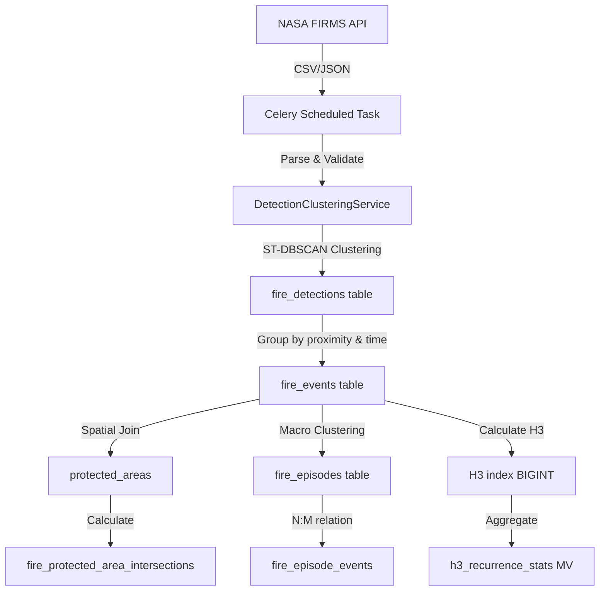
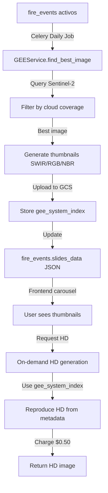
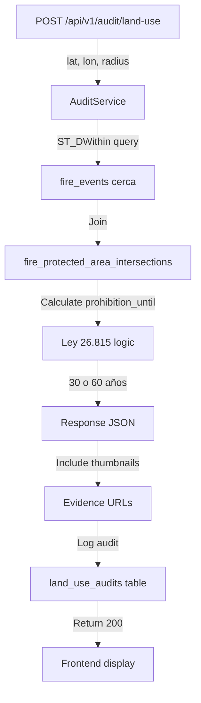
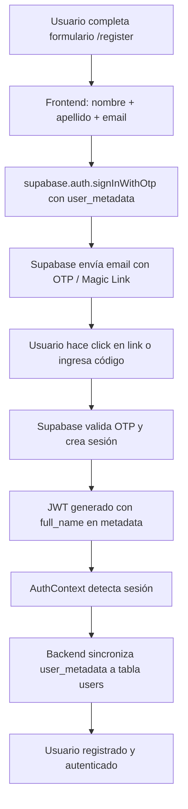

# ForestGuard - Arquitectura del Sistema v2.0

**Fecha de actualización**: Febrero 2026  
**Versión del sistema**: 2.0  
**Estado del proyecto**: 85% completado (21/31 tareas técnicas)

---

## 1. Visión General del Sistema

ForestGuard es una plataforma de **inteligencia geoespacial** para la fiscalización legal y monitoreo de recuperación de zonas afectadas por incendios forestales en Argentina. El sistema transforma datos satelitales (NASA FIRMS, Sentinel-2/Google Earth Engine) en **evidencia legal auditable** bajo la Ley 26.815.

### Objetivos Principales

1. **Fiscalización Legal**: Determinar restricciones de uso del suelo por incendios previos (Art. 22 bis Ley 26.815)
2. **Monitoreo de Recuperación**: Seguimiento de vegetación post-incendio mediante índices NDVI/NBR
3. **Reportes Forenses**: Generación de evidencia técnica para uso judicial con trazabilidad completa
4. **Acceso Público**: Democratización de información satelital dispersa

### Principios Arquitectónicos

#### 🎯 Costo Cero
- **Free tiers exclusivos**: Supabase (500MB), Oracle Cloud, Cloudflare R2, Google Cloud Storage (5GB), Google Earth Engine (50k req/día)
- **Sin servicios pagos**: No AWS, no Azure, no bases de datos comerciales
- **Optimización de cuotas**: Batch processing, materialized views, cached queries

#### ⚡ Async-First
- **Operaciones pesadas delegadas a Celery workers**:
  - Procesamiento de imágenes satelitales
  - Generación de PDFs con evidencia
  - Cálculos espaciales (ST-DBSCAN clustering)
  - Análisis de vegetación (NDVI time series)
- **API responde 202 Accepted** para operaciones long-running
- **Polling endpoints** para consultar estado de jobs

#### 🔄 Reproducibilidad
- **Recetas GEE almacenadas**: `gee_system_index`, `visualization_params`, `bands_config`
- **Evidencia recreatable**: Cualquier imagen HD regenerable on-demand desde metadata
- **Versionado de algoritmos**: `clustering_versions` table rastrea parámetros de clustering
- **Hashes SHA-256**: Verificación de integridad de reportes y certificados

#### 🔒 Seguridad por Defecto
- **Row Level Security (RLS)**: Todas las tablas con políticas Supabase
- **API Keys obligatorias**: Endpoints sensibles requieren autenticación
- **Rate limiting multinivel**: Gateway (Nginx) + endpoint level
- **Idempotency keys**: POST críticos con deduplicación
- **Audit logs inmutables**: `audit_events` table con trazabilidad completa

#### 📍 H3 Spatial Indexing
- **Resolución 7-9**: Usado para análisis de recurrencia en Argentina
- **Stored as BIGINT**: Compatible con PostgreSQL native types
- **Materialized View**: `h3_recurrence_stats` para consultas rápidas
- **Heatmap generation**: Frontend integrado con Leaflet

---

## 2. Diagrama de Arquitectura de Alto Nivel

```
┌─────────────────────────────────────────────────────────────────────────────────┐
│                         FORESTGUARD ARCHITECTURE v2.0                            │
├─────────────────────────────────────────────────────────────────────────────────┤
│                                                                                  │
│  ┌───────────────────────────────────────────────────────────────────────────┐  │
│  │                    FRONTEND (React 18 + Vite + TypeScript)                 │  │
│  │  ┌──────────────┐  ┌──────────────┐  ┌──────────────┐  ┌──────────────┐  │  │
│  │  │ Home/Landing │  │  Dashboard   │  │  Auditoría   │  │  Exploración │  │  │
│  │  │  (Public)    │  │  (UC-F03)    │  │  (UC-F06)    │  │  (UC-F11)    │  │  │
│  │  └──────────────┘  └──────────────┘  └──────────────┘  └──────────────┘  │  │
│  │  ┌──────────────┐  ┌──────────────┐  ┌──────────────┐  ┌──────────────┐  │  │
│  │  │  Mapa M1/V1  │  │  Reportes    │  │ Certificados │  │   Perfil     │  │  │
│  │  │  (Leaflet)   │  │  Ciudadanos  │  │  (UC-F10)    │  │   +Auth      │  │  │
│  │  └──────────────┘  └──────────────┘  └──────────────┘  └──────────────┘  │  │
│  │                                                                            │  │
│  │  📦 State: Context API (Auth, Language) | 🎨 UI: shadcn/ui + TailwindCSS  │  │
│  │  🔄 Router: React Router v6 (20 pages) | 📡 HTTP: Fetch API              │  │
│  └───────────────────────────────────────────────────────────────────────────┘  │
│                                 │                                                │
│                                 ▼                                                │
│  ┌───────────────────────────────────────────────────────────────────────────┐  │
│  │                      NGINX GATEWAY (Oracle Cloud)                          │  │
│  │  • SSL/TLS (Let's Encrypt)  • Rate Limiting (10 req/s public)             │  │
│  │  • CORS Headers             • Request Routing                             │  │
│  │  • Static File Serving      • Gzip Compression                            │  │
│  └───────────────────────────────────────────────────────────────────────────┘  │
│                                 │                                                │
│                                 ▼                                                │
│  ┌───────────────────────────────────────────────────────────────────────────┐  │
│  │               BACKEND API (FastAPI 0.110+ / Python 3.11+)                  │  │
│  │  ┌────────────────────────────────────────────────────────────────────┐   │  │
│  │  │  API Routes (35+ endpoints across 11 v1 routers + 12 legacy)       │   │  │
│  │  │  /api/v1/fires        /api/v1/audit        /api/v1/explorations    │   │  │
│  │  │  /api/v1/analysis     /api/v1/quality      /api/v1/reports         │   │  │
│  │  │  /api/v1/contact      /api/v1/payments     /api/v1/certificates    │   │  │
│  │  └────────────────────────────────────────────────────────────────────┘   │  │
│  │  ┌────────────────────────────────────────────────────────────────────┐   │  │
│  │  │  Service Layer (30 services)                                        │   │  │
│  │  │  • FireService (45KB)      • ERSService (69KB)                      │   │  │
│  │  │  • GEEService (39KB)       • VAEService (33KB)                      │   │  │
│  │  │  • StorageService (28KB)   • AuditService (16KB)                    │   │  │
│  │  │  • EpisodeService (18KB)   • QualityService (14KB)                  │   │  │
│  │  └────────────────────────────────────────────────────────────────────┘   │  │
│  │  ┌────────────────────────────────────────────────────────────────────┐   │  │
│  │  │  Data Models (19 models - SQLAlchemy 2.0)                           │   │  │
│  │  │  FireEvent, FireDetection, Episode, ProtectedArea, User, etc.      │   │  │
│  │  └────────────────────────────────────────────────────────────────────┘   │  │
│  └───────────────────────────────────────────────────────────────────────────┘  │
│                 │                           │                                    │
│                 ▼                           ▼                                    │
│  ┌──────────────────────────┐  ┌──────────────────────────────────────────┐    │
│  │  CELERY WORKERS (Redis)  │  │  SUPABASE (PostgreSQL 15 + PostGIS 3.3)  │    │
│  │  • Episode Clustering    │  │  • 30+ Tables (fire_events, episodes,    │    │
│  │  • Carousel Generation   │  │    protected_areas, users, etc.)         │    │
│  │  • Closure Reports       │  │  • Materialized Views (h3_recurrence,    │    │
│  │  • HD Image Generation   │  │    fire_stats, quality_metrics)          │    │
│  │  • VAE Analysis          │  │  • RLS Policies (anon/authenticated)     │    │
│  │  • NASA FIRMS Ingestion  │  │  • PostGIS Extensions (ST_*, H3)         │    │
│  └──────────────────────────┘  └──────────────────────────────────────────┘    │
│                                                                                  │
│  ┌───────────────────────────────────────────────────────────────────────────┐  │
│  │                      EXTERNAL SERVICES INTEGRATION                         │  │
│  │  ┌─────────────────┐  ┌─────────────────┐  ┌─────────────────┐           │  │
│  │  │  NASA FIRMS     │  │  Google Earth   │  │  Google Cloud   │           │  │
│  │  │  (VIIRS/MODIS)  │  │  Engine (GEE)   │  │  Storage (GCS)  │           │  │
│  │  │  Detections     │  │  Sentinel-2     │  │  Thumbnails     │           │  │
│  │  │  CSV/JSON API   │  │  50k req/day    │  │  5GB free tier  │           │  │
│  │  └─────────────────┘  └─────────────────┘  └─────────────────┘           │  │
│  │  ┌─────────────────┐  ┌─────────────────┐  ┌─────────────────┐           │  │
│  │  │  Open-Meteo     │  │  MercadoPago    │  │  Gmail SMTP     │           │  │
│  │  │  Climate Data   │  │  Payment API    │  │  Contact Form   │           │  │
│  │  │  Free API       │  │  Webhooks       │  │  App Password   │           │  │
│  │  └─────────────────┘  └─────────────────┘  └─────────────────┘           │  │
│  └───────────────────────────────────────────────────────────────────────────┘  │
│                                                                                  │
└─────────────────────────────────────────────────────────────────────────────────┘
```

---

## 3. Stack Tecnológico

### 3.1 Frontend

| Componente | Tecnología | Versión | Propósito |
|------------|-----------|---------|-----------|
| **Framework** | React | 18.x | UI component library |
| **Build Tool** | Vite | 5.x | Fast dev server + bundling |
| **Language** | TypeScript | 5.x | Type safety |
| **Router** | React Router | 6.x | Client-side routing (20 pages) |
| **UI Library** | shadcn/ui | Latest | Accessible components (93 components) |
| **Styling** | TailwindCSS | 3.x | Utility-first CSS |
| **Maps** | Leaflet | 1.9.x | Interactive maps + H3 heatmaps |
| **State** | Context API | Built-in | Auth + i18n context |
| **Testing** | Cypress | Latest | E2E testing |
| **Icons** | Lucide React | Latest | Icon library |

**Estructura de Carpetas**:
```
frontend/src/
├── pages/           # 20 page components (Home, Audit, Exploration, etc.)
├── components/      # 93 reusable components (organized by domain)
├── services/        # 14 API client services
├── hooks/           # 17 custom React hooks
├── types/           # 12 TypeScript type definitions
├── context/         # AuthContext, LanguageContext
└── __tests__/       # Unit + integration tests
```

### 3.2 Backend

| Componente | Tecnología | Versión | Propósito |
|------------|-----------|---------|-----------|
| **Framework** | FastAPI | 0.110+ | Async REST API |
| **Language** | Python | 3.11+ | Core language |
| **ORM** | SQLAlchemy | 2.0+ | Database abstraction |
| **Validation** | Pydantic | 2.x | Request/response schemas |
| **Task Queue** | Celery | 5.x | Background workers |
| **Message Broker** | Redis | 7.x | Celery backend |
| **HTTP Client** | httpx | 0.26+ | Async HTTP requests |
| **Spatial** | Shapely | 2.x | Geometry operations |
| **Testing** | pytest | 8.x | Unit + integration tests |

**Estructura de Carpetas**:
```
app/
├── api/
│   ├── v1/          # 11 modern routers (fires, audit, explorations, etc.)
│   └── routes/      # 12 legacy routers (transitioning to v1)
├── services/        # 30 business logic services
├── models/          # 19 SQLAlchemy models
├── schemas/         # 15 Pydantic schemas
├── core/            # Config, middleware, security, logging
├── workers/         # Celery worker definitions
└── utils/           # Shared utilities
```

### 3.3 Base de Datos

| Componente | Tecnología | Versión | Propósito |
|------------|-----------|---------|-----------|
| **Database** | PostgreSQL | 15.x | Primary data store |
| **Spatial Extension** | PostGIS | 3.3+ | Geospatial operations |
| **H3 Extension** | h3-pg | Latest | H3 indexing |
| **Hosting** | Supabase | Cloud | Managed Postgres (500MB free) |
| **Migrations** | Custom SQL | - | 23 migration scripts |
| **Auth** | Supabase Auth | Built-in | JWT + RLS |

**Capacidad**:
- 30+ tablas principales
- 3 materialized views (`h3_recurrence_stats`, `fire_stats`, `fire_event_quality_metrics`)
- RLS policies en todas las tablas sensibles
- Índices GiST para columnas geometry
- Particionado en `fire_detections` (por fecha)

### 3.4 Infraestructura

| Componente | Proveedor | Plan | Propósito |
|------------|-----------|------|-----------|
| **Compute** | Oracle Cloud | Always Free (Ampere ARM) | API + Workers hosting |
| **Database** | Supabase | Free Tier (500MB) | PostgreSQL + PostGIS |
| **Storage (Thumbnails)** | Google Cloud Storage | 5GB free | Persistent thumbnails |
| **CDN/Images** | Cloudflare R2 | Free tier | Alternative storage |
| **Web Server** | Nginx | Self-hosted | Reverse proxy + SSL |
| **SSL** | Let's Encrypt | Free | HTTPS certificates |
| **Process Manager** | systemd | Built-in | Service orchestration |

---

## 4. Flujo de Datos Principal

### 4.1 Ingesta de Detecciones (NASA FIRMS)



**Frecuencia**: Diaria (Celery Beat scheduled task)  
**Volumen**: ~1000-5000 detecciones/día para Argentina  
**Storage**: `fire_detections` particionado por fecha, archivado a Parquet tras 90 días

### 4.2 Generación de Imágenes Satelitales (GEE)



**Batch Size**: 15 incendios/corrida  
**Cuota GEE**: 50k req/día, 40 ops simultáneas  
**Storage**: Solo thumbnails persistentes (< 500KB cada uno), HD on-demand

### 4.3 Auditoría Legal (UC-F06)



**Rendimiento**: < 2s para consultas normales  
**Rate Limit**: 10 req/min por IP  
**Seguridad**: API key obligatoria + RLS

---

## 4.4 Autenticación y Landing Page

### Sistema de Autenticación

ForestGuard implementa un sistema de autenticación multi-modal basado en **Supabase Auth** que permite tres flujos de acceso:

#### Métodos de Autenticación Disponibles

| Método | Tecnología | Flujo | Estado |
|--------|-----------|-------|--------|
| **Google OAuth** | Supabase OAuth + Google Cloud | Redirect a Google → callback Supabase → JWT | ✅ Implementado |
| **Email Passwordless** | Supabase Email OTP (Magic Link) | Email → OTP code → Autenticación | ✅ Implementado |
| **Acceso Anónimo** | Supabase anon role | Sin autenticación, acceso limitado | ✅ Implementado |

#### Flujo de Autenticación Google OAuth

```mermaid
graph TD
    A[Usuario hace click en "Continuar con Google"] --> B[Frontend llama a supabase.auth.signInWithOAuth]
    B --> C[Redirect a Google OAuth Consent]
    C --> D[Usuario autoriza en Google]
    D --> E[Google redirect a Supabase callback]
    E --> F[Supabase genera JWT con user metadata]
    F --> G[Redirect a aplicación con session en localStorage]
    G --> H[AuthContext detecta sesión vía onAuthStateChange]
    H --> I[Backend GET /auth/me valida JWT]
    I --> J[get_or_create_supabase_user crea/actualiza user en DB]
    J --> K[Usuario autenticado]
```

**Configuración requerida**:
- **Google Cloud Console**: OAuth 2.0 Client ID con redirect URI `https://<project-ref>.supabase.co/auth/v1/callback`
- **Supabase Dashboard**: Provider Google habilitado con Client ID + Client Secret
- **Variables de entorno**:
  ```bash
  VITE_SUPABASE_URL=https://<project-ref>.supabase.co
  VITE_SUPABASE_ANON_KEY=<anon-key>
  VITE_USE_SUPABASE_JWT=true
  ```

#### Flujo de Registro Passwordless (Email OTP)



**Metadata almacenado en JWT**:
```javascript
{
  user_metadata: {
    full_name: "Juan Pérez",
    first_name: "Juan",
    last_name: "Pérez"
  }
}
```

**Persistencia**: El backend endpoint `GET /auth/me` sincroniza automáticamente el `user_metadata` de Supabase Auth a la tabla `users` local usando la función `get_or_create_supabase_user()`.

#### Gestión de Sesión

**Componente**: `src/context/AuthContext.tsx`

**Hooks disponibles**:
```typescript
interface AuthContextValue {
  user: User | null;
  session: Session | null;
  isLoading: boolean;
  signInWithGoogle: () => Promise<void>;
  signUpWithEmail: (payload: { email: string; firstName: string; lastName: string }) => Promise<void>;
  signInWithEmail: (email: string, password: string) => Promise<void>;
  signOut: () => Promise<void>;
}
```

**Persistencia de sesión**:
- La sesión se almacena en `localStorage` por Supabase SDK
- `AuthProvider` ejecuta `supabase.auth.getSession()` al mount
- `onAuthStateChange` listener sincroniza cambios de sesión
- JWT se inyecta automáticamente en headers `Authorization: Bearer <token>` si `VITE_USE_SUPABASE_JWT=true`

### Landing Page & Login UX

La página de Landing/Login es el **punto de entrada principal** del sistema, diseñada para combinar información sobre la misión del proyecto con un acceso fluido a las funcionalidades.

#### Estructura Visual

**Layout**: Split screen (desktop), stacked (mobile)

```
┌─────────────────────────────────────────────────────────────┐
│                                                               │
│  ┌──────────────────────────┐   ┌─────────────────────────┐ │
│  │  CONTENIDO (Izquierda)   │   │   IMAGEN (Derecha)      │ │
│  │                          │   │                         │ │
│  │  • Logo ForestGuard      │   │   Bosque post-incendio  │ │
│  │  • H1 animado            │   │   (lazy loaded WebP)    │ │
│  │  • H2 descripción        │   │                         │ │
│  │  • Leyenda misión        │   │   Hidden en mobile      │ │
│  │                          │   │                         │ │
│  │  • Formulario login      │   │                         │ │
│  │    - Email              │   │                         │ │
│  │    - Password (si aplica)│   │                         │ │
│  │    - Botón Google (CTA)  │   │                         │ │
│  │    - Separador          │   │                         │ │
│  │    - "Acceso invitado"   │   │                         │ │
│  │    - Link a /register    │   │                         │ │
│  │                          │   │                         │ │
│  └──────────────────────────┘   └─────────────────────────┘ │
│                                                               │
└─────────────────────────────────────────────────────────────┘
```

#### Copy Definido

| Elemento | Contenido |
|----------|-----------|
| **H1** (animado) | "La huella del fuego, vista desde el espacio." |
| **H2** | "Genera líneas de tiempo satelitales de incendios en Argentina." |
| **Leyenda** | "Compara el antes y el después: detecta revegetación natural o construcciones no autorizadas en zonas afectadas." |

#### Componente AnimatedGradientText

**Ubicación**: `src/components/ui/AnimatedGradientText.tsx`

**Comportamiento**:
- **Animación**: Gradiente que revela el texto de izquierda a derecha (1.2s duration)
- **Tecnología**: Framer Motion con `background-position` animation (GPU accelerated)
- **Accessibility**: Respeta `prefers-reduced-motion` (muestra texto estático)
- **Fallback**: Detección de `CSS.supports('background-clip', 'text')` para navegadores legacy

**Implementación técnica**:
```tsx
<AnimatedGradientText
  as="h1"
  text="La huella del fuego, vista desde el espacio."
  className="text-4xl lg:text-5xl font-bold tracking-tight"
  duration={1.2}
  delay={0.2}
  fromColor="#9ca3af" // gray-400
  toColor="#111827"   // gray-900
/>
```

**Performance**:
- Usa `will-change-[background-position]` para GPU acceleration
- Solo anima properties compuestas (sin reflow)
- Cleanup automático de animaciones (previene memory leaks)

#### Formulario de Autenticación

**Estilos **:
```tsx
// Input base
className="bg-gray-50 border-gray-200 rounded-lg px-4 py-3 
           focus:ring-2 focus:ring-emerald-500/20 focus:border-emerald-500
           placeholder:text-gray-400 transition-all duration-200"

// Botón CTA (Google)
className="bg-emerald-600 hover:bg-emerald-700 text-white 
           font-medium py-3 rounded-lg transition-colors"

// Botón secundario (Email/Password)
className="bg-white border border-gray-200 text-gray-700 
           hover:bg-gray-50 py-3 rounded-lg"
```

**Jerarquía visual**:
1. **CTA principal**: "Continuar con Google" (emerald-600, full-width)
2. **Separador**: Línea horizontal con "o" centrado
3. **Acceso alternativo**: "Acceder como invitado" (outline button)
4. **Link de registro**: "¿No tenés cuenta? Registrate" (text link)

#### Responsive Breakpoints

| Breakpoint | Comportamiento |
|------------|----------------|
| **< 640px (mobile)** | Una columna, imagen oculta, formulario arriba |
| **640px - 1024px (tablet)** | Dos columnas, imagen reducida |
| **≥ 1024px (desktop)** | Layout completo, imagen 50% viewport |

**Implementación**:
```tsx
<div className="min-h-screen flex flex-col lg:flex-row">
  <div className="flex-1 flex flex-col justify-center px-6 py-12 lg:px-12">
    {/* Hero + Form */}
  </div>
  <div className="hidden lg:block lg:flex-1 relative">
    <picture>
      <source srcSet="/images/forest-hero.avif" type="image/avif" />
      <source srcSet="/images/forest-hero.webp" type="image/webp" />
      
    </picture>
  </div>
</div>
```

#### Accesibilidad (WCAG 2.1 AA)

| Requisito | Implementación |
|-----------|----------------|
| **Labels asociados** | `<label htmlFor="email">` o `aria-label` en inputs |
| **Contraste texto** | Gray-900 sobre blanco = 15.1:1 ✅ |
| **Contraste placeholder** | Gray-400 sobre gray-50 ≥ 4.5:1 ✅ |
| **Focus visible** | Ring de 2px emerald-500/20 + border emerald-500 |
| **Reduced motion** | `useReducedMotion()` hook desactiva animación H1 |
| **Orden de tab** | Natural (top → bottom) |
| **Errores anunciados** | `aria-live="polite"` en mensajes de validación |

#### Performance Optimizations

**Core Web Vitals targets**:
- **LCP** < 2.5s: Preload de imagen hero + fuente Inter
- **FID** < 100ms: No hay JS blocking en landing
- **CLS** < 0.1: Reserva de espacio para imagen + `font-display: swap`

**Implementación**:
```html
<!-- Preload crítico -->
<link rel="preload" as="image" href="/images/forest-hero.webp" 
      type="image/webp" media="(min-width: 1024px)" />
<link rel="preload" as="font" href="/fonts/inter-var.woff2" 
      type="font/woff2" crossorigin />
```

#### Data-testid para E2E

| Elemento | data-testid |
|----------|-------------|
| Título H1 | `hero-title` |
| Input email | `login-email` |
| Input password | `login-password` |
| Botón Google | `login-google` |
| Botón submit | `login-submit` |
| Botón invitado | `login-guest` |
| Mensaje de error | `login-error` |
| Formulario container | `login-form` |

### Página de Registro (/register)

**Layout**: Idéntico a `/login`, reemplazando formulario de login por formulario de registro.

**Campos del formulario**:
```tsx
interface RegisterFormData {
  first_name: string;  // required, min 2, max 50
  last_name: string;   // required, min 2, max 50
  email: string;       // required, email format
}
```

**Flujo de registro**:
1. Usuario completa formulario
2. Frontend valida con `react-hook-form` + `zod`
3. Llama a `signUpWithEmail({ email, firstName, lastName })`
4. Supabase envía magic link a email
5. Se muestra mensaje: "Te enviamos un link a tu email para finalizar el registro"
6. Usuario hace click en link → autenticación completa
7. `GET /auth/me` sincroniza datos a tabla `users`

**Validación Zod**:
```typescript
const registerSchema = z.object({
  first_name: z.string().min(2, "Mínimo 2 caracteres").max(50),
  last_name: z.string().min(2, "Mínimo 2 caracteres").max(50),
  email: z.string().email("Email inválido"),
});
```

---

## 5. Seguridad y Compliance

### 5.1 Niveles de Acceso

| Rol | Descripción | Permisos |
|-----|-------------|----------|
| **anon** | Usuario no autenticado | Solo Edge Functions públicas (stats) |
| **authenticated** | Usuario registrado | Fires dashboard, análisis, reportes |
| **admin** | Administrador del sistema | Workers, health checks, system params |

### 5.2 Row Level Security (RLS)

Todas las tablas sensibles tienen políticas RLS en Supabase:

```sql
-- Ejemplo: user_saved_filters
CREATE POLICY "Users can only see their own filters"
  ON user_saved_filters
  FOR SELECT
  USING (auth.uid() = user_id);

-- Ejemplo: exploration_investigations
CREATE POLICY "Users can only see their own investigations"
  ON exploration_investigations
  FOR ALL
  USING (auth.uid() = user_id);
```

### 5.3 Rate Limiting

| Endpoint | Límite | Justificación |
|----------|--------|---------------|
| `/api/v1/contact` | 5 req/15min | Anti-spam |
| `/api/v1/audit/land-use` | 10 req/min | Evitar scraping |
| `/functions/v1/public-stats` | 100 req/min | DoS prevention |
| General (autenticado) | 60 req/min | Fair use |

### 5.4 Idempotency

Endpoints críticos usan idempotency keys (tabla `idempotency_keys`):
- `POST /api/v1/reports/judicial`
- `POST /api/v1/reports/historical`
- `POST /api/v1/certificates`
- `POST /api/v1/payments/*`

**Expiración**: 24 horas  
**Hash**: Request body + endpoint + user_id

### 5.5 Audit Logging

Tabla `audit_events` registra:
- Acciones administrativas
- Accesos a datos sensibles
- Modificaciones de sistema
- Intentos fallidos de autenticación

**Retención**: Indefinida (inmutable)

---

## 6. Optimización de Costos (FinOps)

### 6.1 Límites Estrictos

| Recurso | Límite Hard | Estrategia de Mitigación |
|---------|-------------|--------------------------|
| **Supabase DB** | 500MB | Particionado + archivado a Parquet |
| **GCS Storage** | 5GB | Retention policy (7 días GeoTIFF, 90 días PDF) |
| **GEE Requests** | 50k/día | Batch processing + metadata reutilización |
| **SMTP Emails** | 500/día | Rate limiting + queue |
| **Celery Workers** | 2 workers | Priorización de tareas |

### 6.2 Estrategia de Imágenes

| Tipo | Storage | Costo | Uso |
|------|---------|-------|-----|
| **Thumbnails** | GCS persistente | Incluido en 5GB | Carousel, previews |
| **HD Images** | On-demand (no persiste) | $0.50/imagen | Reportes pagos |
| **GeoTIFFs** | GCS 7 días | Incluido en 5GB | Análisis temporal |
| **PDFs** | GCS 90 días | Incluido en 5GB | Reportes generados |

### 6.3 Materialized Views

Para evitar queries costosas diarias:
- `h3_recurrence_stats`: Agregaciones por celda H3 (refresh diario)
- `fire_stats`: KPIs pre-calculados por provincia/mes
- `fire_event_quality_metrics`: Scores de confiabilidad precalculados

**Refresh**: Celery Beat daily @ 02:00 ART

---

## 7. Monitoreo y Observabilidad

### 7.1 Health Checks

```
GET /health
GET /api/v1/health/db
GET /api/v1/health/gee
GET /api/v1/health/celery
```

**Uptime**: Monitoreado por UptimeRobot (free tier)  
**Alertas**: Email si downtime > 5 min

### 7.2 Logs

Estructura de logs (JSON format):
```json
{
  "timestamp": "2026-02-09T14:00:00Z",
  "level": "INFO",
  "request_id": "uuid-v4",
  "endpoint": "/api/v1/fires",
  "duration_ms": 234,
  "user_id": "uuid-or-null",
  "ip": "x.x.x.x"
}
```

**Retención**: 30 días local, rotación diaria  
**Sensitive data**: Sanitizado (no PII en logs)

### 7.3 Métricas

KPIs rastreados:
- Latencia p50/p95/p99 por endpoint
- Error rate (4xx, 5xx)
- GEE quota usage
- Database size growth
- Worker queue length
- Active fires count

**Dashboard**: Pendiente (T6.4 - Grafana setup)

---

## 8. Próximos Pasos (Roadmap Pendiente)

### Fase 4: Refactoring & Security (2-5 días)
- ✅ T4.1: Hard caps en system_parameters
- ⏳ T4.2: Performance (MV migration, GIST indexes)
- ⏳ T4.3: Resilience (unit test coverage 80%+)

### Fase 5: Exploration & Reports (8-10 días)
- ✅ T5.1: Satellite Exploration wizard (IMPLEMENTADO - pendiente doc)
- ✅ T5.2: Historical Reports (IMPLEMENTADO - pendiente doc)
- ⏳ T5.3: PDF generation con hash + QR

### Fase 6: Testing & Observability (5-7 días)
- ⏳ T6.1-T6.2: Integration tests + E2E tests
- ⏳ T6.3: Load testing con Locust
- ⏳ T6.4: Monitoring setup (Grafana + Prometheus)

**Prioridad actual**: Finalizar documentación (este documento), luego T4.2 optimización.

---

## Apéndices

### A. Variables de Entorno Críticas

```bash
# Database
DATABASE_URL=postgresql://...
SUPABASE_URL=https://...
SUPABASE_KEY=...

# GEE
GOOGLE_APPLICATION_CREDENTIALS=/path/to/gee-credentials

# Storage
GCS_BUCKET_NAME=bucket-one-project
GCS_PROJECT_ID=...

# Workers
CELERY_BROKER_URL=redis://localhost:6379/0
CELERY_RESULT_BACKEND=redis://localhost:6379/1

# Security
SECRET_KEY=... # cryptographically secure
API_KEY_HEADER=X-API-Key

# External Services
NASA_FIRMS_API_KEY=...
MERCADOPAGO_ACCESS_TOKEN=...
SMTP_USERNAME=...
SMTP_PASSWORD=...
```

### B. Referencias Externas

- **NASA FIRMS**: https://firms.modaps.eosdis.nasa.gov/
- **Google Earth Engine**: https://earthengine.google.com/
- **Ley 26.815 (Argentina)**: http://servicios.infoleg.gob.ar/infolegInternet/anexos/195000-199999/196084/norma.htm
- **H3 Spatial Index**: https://h3geo.org/
- **Supabase Docs**: https://supabase.com/docs

---

**Documento generado**: Febrero 2026  
**Próxima revisión**: Tras completar Fase 6 (Testing & Observability)
